# prompt10 response — the bail-out (finale, part 1)

Implemented by Claude Code (Opus 5.5), 2026-10-02. The separate hovering arena is gone. The flight now flies into the boss's cloud, the gingerbread pilot bails out under a candy parachute, and the fight happens on foot on a candy rooftop in the same city. The boss is the same rig with the same stages and attacks, retargeted at a grounded pilot. Both HUD bars are removed, and DESIGN.md's finale is rewritten.

## What changed

### The arrival: one continuous move, no cut (`FlightScene.arrive` / `updateBail`, `view/CloudCover.js`)

**At the cloud:**
- The glider climbs while the boss swells on the horizon (as before), and the banner reads **THE CLOUD! / Bail out!**
- At +0.95 s the pilot **pops out of the cockpit** with a puff and a tumbling hop.
- The empty glider keeps flying into the cloud, shrinking and fading, and vanishes in a puff.
- At +1.35 s the **peppermint parachute snaps open**, and he drifts to centre-screen, swaying.

**Through the cloud:** from +1.55 s a **cloud wall** rises around him and covers the screen by +2.45 s. The pilot stays in front of it the whole time.

**The hand-over (+2.6 s).** The rooftop scene starts **inside the identical cloud wall**:
- `CloudCover` is seeded, so both scenes build the same picture.
- The pilot is passed over at the same position, scale and sway phase.
- There is no fade. The scene change happens under full cover and can't be seen (screenshots 4a/4b are the last and first frames).

**On the roof:**
- The cloud wall parts (puffs drift outward and up, the backing fades).
- He floats down onto the roof, the chute pops off and floats away, he lands with a squash and a puff, and **MELT HIM!** appears.
- The HUD fades in, and the boss starts attacking 0.9 s later.

**Retry or dev entry.** A **RETRY BOSS** or `?scene=boss` drops him in by parachute from above the screen. No cloud wall, since there's no flight to come from.

### The rooftop (`objects/Rooftop.js`)

- **The roof.** A frosted roof with a low candy-cane railing along the back and frosting beads and drips spilling over the front edge. Below it is a sugar-brick facade with lit arched windows. All of it is baked once into a texture, like the city strip.
- **Chimneys are cover.** Two gingerbread-brick chimneys with icing caps stand **in front of** the pilot.
  - Behind one he crouches. Goo that reaches him splats on the chimney instead, but **he can't shoot**, so cover has a cost.
- **The skyline.** The rest of the city (the existing `City` strip, frost meter included) sits right behind the roof. `City` gained an optional `bottom` so the strip can sit behind the roof.
- **Goo that misses lands on the roof:** pooled green splats that fade over about 3.5 s. **Throws aimed at the city still land on the skyline and frost it**, as before.

### The pilot (`objects/Pilot.js`)

**Art:** a gingerbread man with a pink aviator cap, goggles pushed up, an icing smile and candy buttons. He holds a **jelly-bean blaster**: a striped barrel with a gumball hopper. The rig is shared, so the flight's bail-out uses the same art (`buildPilotView`).

**Controls (one thumb):**
- **Drag anywhere** to run: relative, with the same sensitivity as glider steering.
- **Keep the finger down** to spray. Lift to stop.
- **SHAKE** button cleanses. BOOST is gone on the roof.
- Keyboard: A/D or arrows to run, hold Space to fire, X to shake.

**The blaster:**
- Each bean is the same bean with the **same damage (1 HP per hit)**, the same speed and the same goo-popping. Range is longer (1.15 s life) so it reaches him from the roof.
- It fires bursts at about 7.7 beans/s from a **12-bean gumball hopper that refills at 3/s**, so held fire sputters to a steady trickle.
- The barrel tilts up to 0.3 rad toward the boss, with a little spray.
- **Why the hopper:** I didn't plan it; balance forced it (numbers below). Without it the giant boss is so easy to hit that he melted in 17 s and his stages flashed by.

**Goo (kept simple, same numbers as the glider):**
- It uses the same goo amount per hit, `applyGoo` rules (×1.5 while shaking), tiers, cap and drip formula, and the same √mass model.
- Goo makes him **run slower**, and his fire rate slows at SPLATTERED/CAKED (the glider's ×1.25/×1.7).
- Goo is visible as blobs on his body, a green tint and drips.
- **SHAKE** flings it all off with the same 0.9 s wobble, and uses the run's shake charges.
- There's no death spiral on foot; on the rooftop you can only lose to city frost.

### The boss (`objects/MarshmallowMan.js`)

- He's the same rig, stages, HP thresholds and attack styles, at **giant scale** (1.3× on a 1169 px canvas, 1.1× on 960). His cloud, puddle and sway scale with him.
- **Retargeted at a grounded target** (new `ground` flag):
  - **Throws:** aimed lobs land at the pilot's feet.
  - **SAGGING bombs:** burst over him, and their splatter now lands on the roof.
  - **ARM OFF! swat:** fires when you stand within about 190 px either side of him, sweeping and spraying straight down. The spray lives just long enough to reach the roof.
  - **COLLAPSING lobs:** droop short onto the roof.
- City throws are now flagged (`{ city: true }`), so the scene knows which goo frosts the skyline. The aimed-or-city choice and its odds per stage are unchanged.

### HUD bars removed (`ui/Hud.js`)

- **TO THE CLOUD**, **MELT-O-METER**, their panel, the stage-name readout and the progress glider icon are all **deleted**, per DESIGN.md's "no HUD bars". Nothing replaces them:
  - Flight progress is the boss growing on the horizon.
  - His health is his melting body (stage banners still announce each stage).
- What remains: the GOO and CITY FROST chips at the top corners, the mute button, the cleanse buttons, banners and warnings.

### DESIGN.md

- **Core loop:** "reach the cloud → melt the boss in staged hit-and-runs" becomes "fly into his cloud and bail out → melt the boss from a rooftop".
- **Controls:** a rooftop line added.
- **Boss section:** the "every attack run is a dive" line is updated for the rooftop, including ARM OFF!'s downward swat.
- **Finale section:** replaced with **"Finale: the bail-out (no arena, no cut)"**, covering arrival, rooftop, fight and the flood payoff (kept, for prompt11).
- Nothing else changed. The open questions are untouched; Finch owns those.

### Smaller changes

- `Projectiles.js`: goo can carry its own `landY` (the roof) with an `onLand` callback, and beans take an optional `life`.
- `sfx.js`: `bail`, `chute` and `land` sounds.
- The flight now starts the boss scene with explicit data (`{ bailout: true, … }`). That incidentally fixes prompt8's flagged stale-`retry` bug: a normal arrival can no longer inherit an old `{ retry: true }`.

## Verification

**Environment:** the in-app browser with the Vite dev server, booted at both 540×1169 (phone emulation, touch) and 540×960. Frames were driven with `__game.loop.sleep()` + `__game.step()`, paced 16 ms apart wherever wall-clock tweens matter (boss wind-ups, the chute, fades). Input went through the real DOM paths (`TouchEvent` on the canvas and `MouseEvent`). `npm run build` is clean.

| Criterion | What I observed |
| --- | --- |
| Flight flows into the cloud; the bail-out reads clearly | Screenshots 1–6: the pilot pops out above the climbing glider (1); the chute opens in front of the looming boss as the glider vanishes into his cloud (2); the cloud wall rises with his eyes peeking over (3); clouds part to reveal the roof (5); he lands, the chute floats off, MELT HIM! (6). |
| No scene cut | Last flight frame: pilot (270, 344) at scale 0.886. First rooftop frame: pilot (270, 345) at scale 0.887, inside the same seeded cloud wall (4a vs 4b look identical). No fade anywhere in the arrival. |
| Pilot movement | Touch: a 100 px drag moved him 135 px (the steering sensitivity). Mouse: a 150 px drag moved him to the target. Keyboard steering goes through the same `steerBy`. He stays within x 40–500. |
| Machine gun | Touch held: firing true; lifted: false. Bursts at about 7.7/s, then the hopper trickle at 3/s. Every hit removes 1 HP (`boss.hit`, unchanged). |
| SHAKE on foot | Touch on the SHAKE button with 1.2 goo: goo → 0, charges 2 → 1, 0.85 s wobble. |
| Cover | Pilot moved behind the left chimney: `covered` true and `tryFire()` returns nothing. A goo-mallow dropped straight onto him was absorbed by the chimney (his goo stayed 0). The same drop in the open: goo 1.08. Screenshot 8 shows him partly behind the right chimney under the swaying boss. |
| All boss stages and behaviours intact | **Bot fight** (real-time paced; holds fire, follows the boss, dodges predicted landings). Stage changes at 5.9 / 15.5 / 26.1 / 35.2 s. Throws per stage: 2 / 4 / 11 / 3 (city: 0 / 1 / 3 / 0). SAGGING bombs burst: 4. ARM OFF! swats: 6. Pilot splatted 3×. Frost peak 7%. Won at 36.2 s (116 beans, 100 hits). Screenshot 9: ARM OFF! with the stump, the downward swat spray hitting the pilot (DUSTED), goo splats on the roof. HP thresholds, damage, goo amounts and stage styles are unchanged in code. |
| Win flow | Melt → fluff flood → End "MELTDOWN!" (screenshot 10). City-thaw code unchanged. |
| Both bars gone | Screenshots 7–9: only the GOO / CITY FROST chips and the mute button at the top. `Hud.js` no longer has bar, title or status code. |
| DESIGN.md updated | See the diff summary above. |
| Zero console errors | None across both canvas sizes, the full arrival, the bot fight, the swat, the win, touch and mouse. |

**Balance note.** In the first bot fight, without the hopper, he melted in **17.5 s at an 85% hit rate**. The giant boss is a big target, and nine beans a second from right under him is too much. With the hopper he takes about 36 s, and every stage gets 9–11 s on stage. The glider fight was about 62 s in prompt5's bot run. I left final pacing for prompt11's end-to-end balance pass; the knobs are `HOPPER` and `REFILL` in `Pilot.js`.

## Screenshots

| | |
| --- | --- |
| 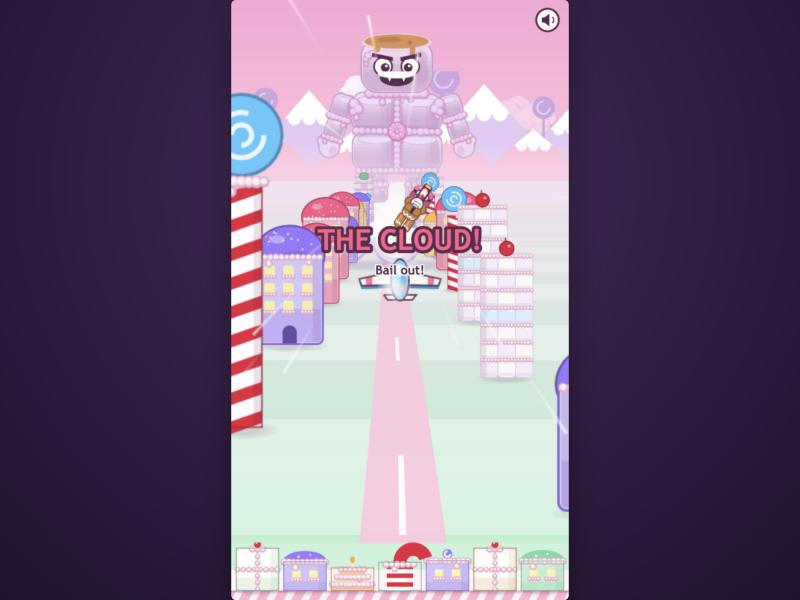 | 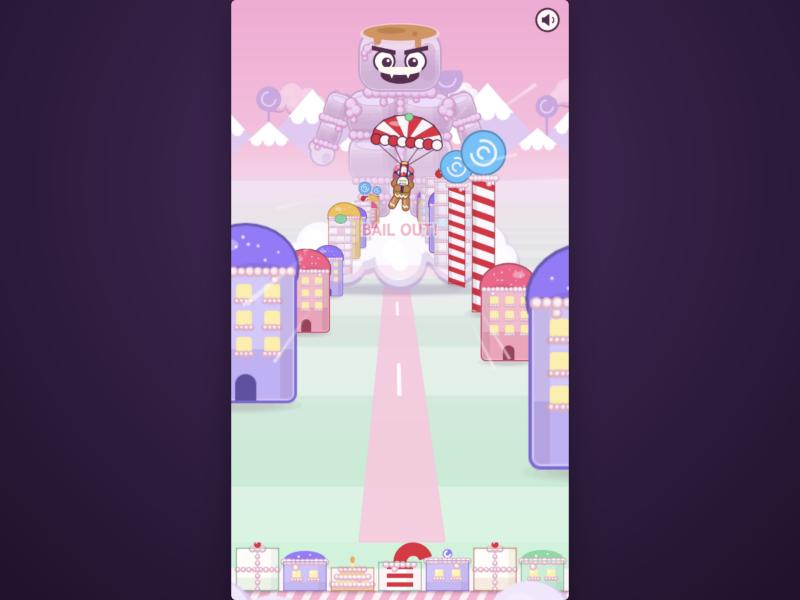 |
| 1. THE CLOUD! The pilot pops out over the glider | 2. Chute open; the glider has vanished into the cloud |
| 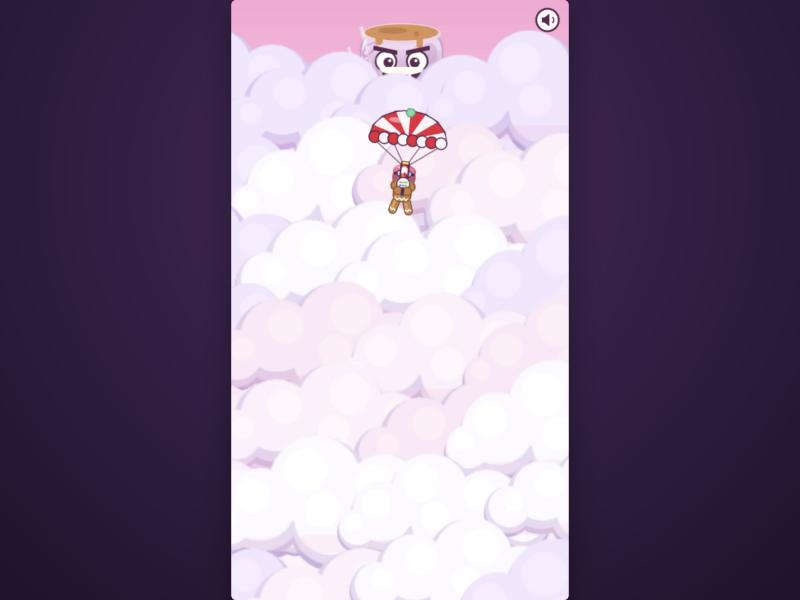 | 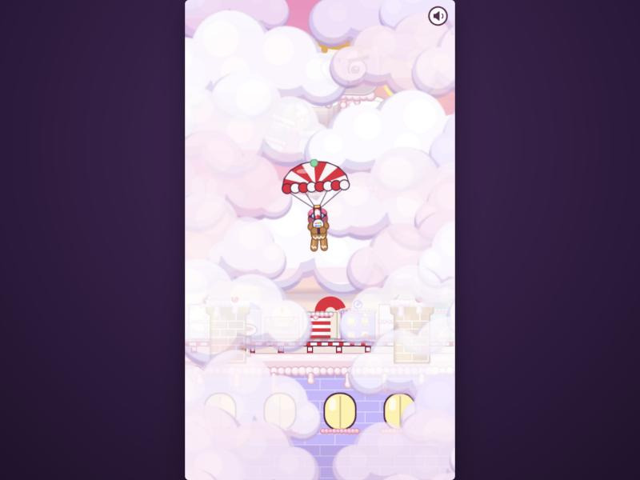 |
| 3. The cloud wall rises around him | 5. On the roof side: the wall parts |
| 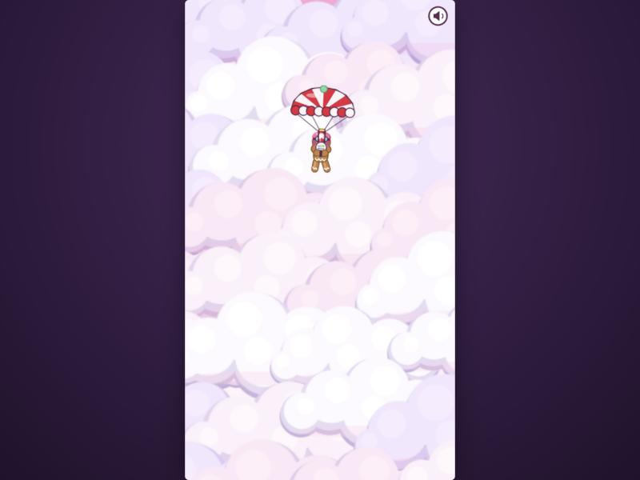 | 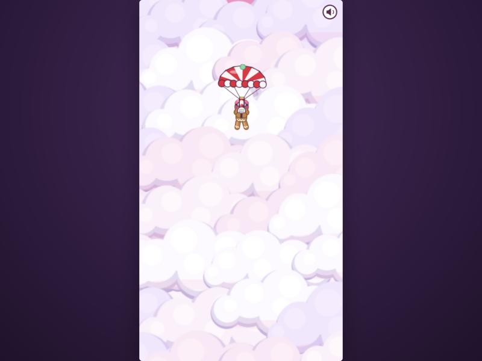 |
| 4a. Flight, last frame before the hand-over | 4b. Rooftop, first frame after it (identical) |
| 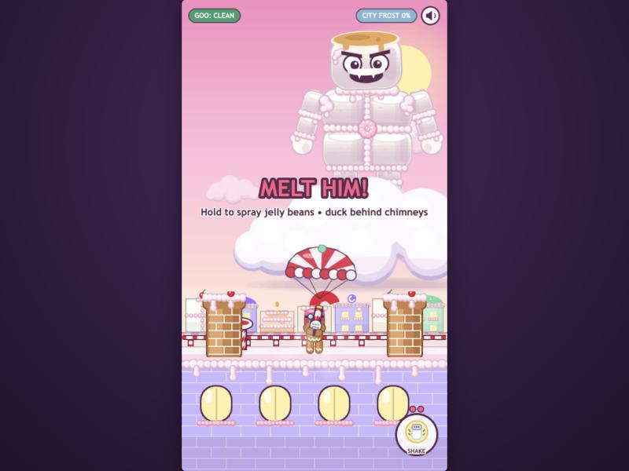 | 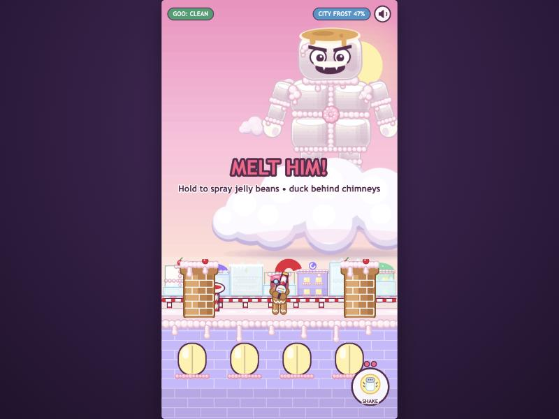 |
| 6. Landed: the chute floats off, MELT HIM! | 7. The rooftop (960 canvas): no bars; frosted skyline visible behind the roof |
| 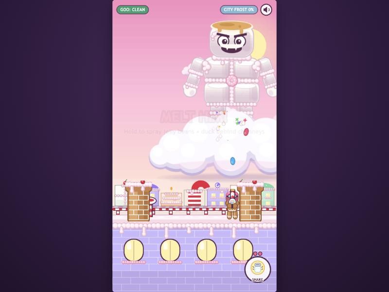 | 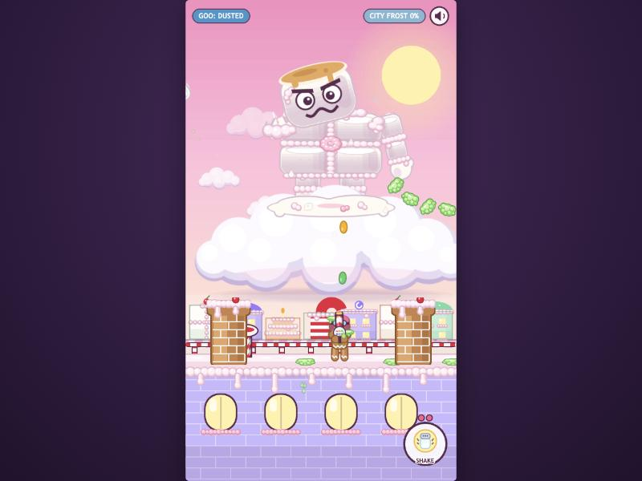 |
| 8. Spraying beans; the pilot drifting behind a chimney | 9. ARM OFF!: the downward swat spray, goo on the pilot and the roof |
| 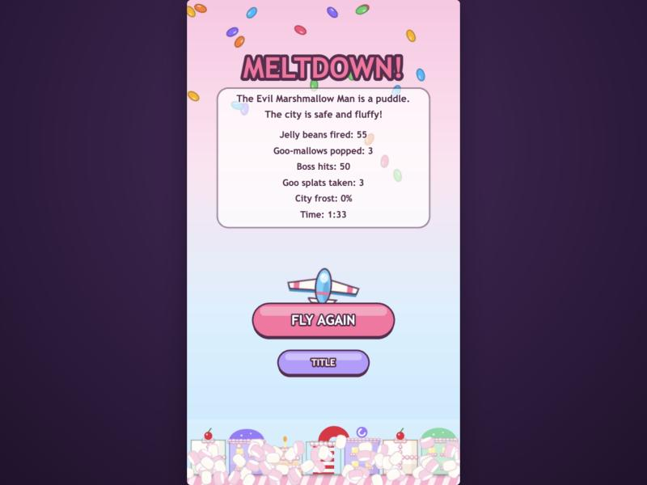 | |
| 10. Win → MELTDOWN! | |

## Deferred or skipped

- **The flood finale is the existing one** (fluff pours down, city thaws, End screen). Staging it as the emotional payoff, with residents thawing, is prompt11.
- **The End screen still shows the glider.** Showing the pilot there fits prompt11's payoff work.
- **No personal lose condition on foot.** Goo slows him but he can't spiral, so on the rooftop the city frost is the only way to lose. If Finch wants personal stakes back, "CAKED = stuck in place until you shake" would be a small addition.
- **BOOST charges carry over but have no use on the roof.** Only SHAKE is offered there; the prompt only mentions SHAKE.
- **The hopper is an addition** to "hold to spray". It's flagged here because it changes how the gun feels (bursts, then a trickle).

## Notes for the next prompt

- **Traps (prompt11).** The roof already has a pooled decal system (`Rooftop.splat`) and a per-goo landing line (`landY` / `onLand`). A sticky patch is a natural extension: a decal plus an x-range that slows `Pilot` (scale `RUN_SPEED` the way goo mass does).
- **Balance knobs:**
  - Pilot: `HOPPER`, `REFILL`, `FIRE_CD`, `SPREAD`, `AIM_MAX` (`Pilot.js`).
  - Boss: swat reach `SWAT_UNDER` (`MarshmallowMan.js`); boss size and layout in `BossScene.create`.
  - Bail-out timing: the `BAIL_*` constants in `FlightScene.js`.
- **ARM OFF!'s city-throw share** (flagged since review-4) still applies: in the bot fight, 3 of its 11 throws went at the city.
- **Harness notes:**
  - A paced bot is needed for boss behaviour, since wind-ups are wall-clock tweens.
  - `BossScene.controls.dragId = <id>` simulates a held finger.
