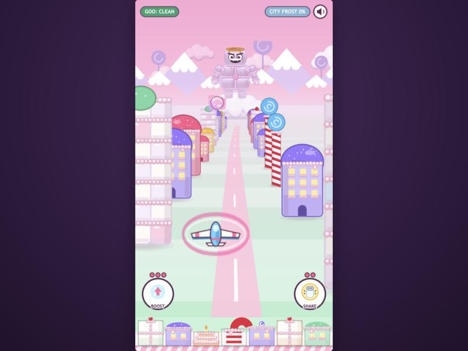
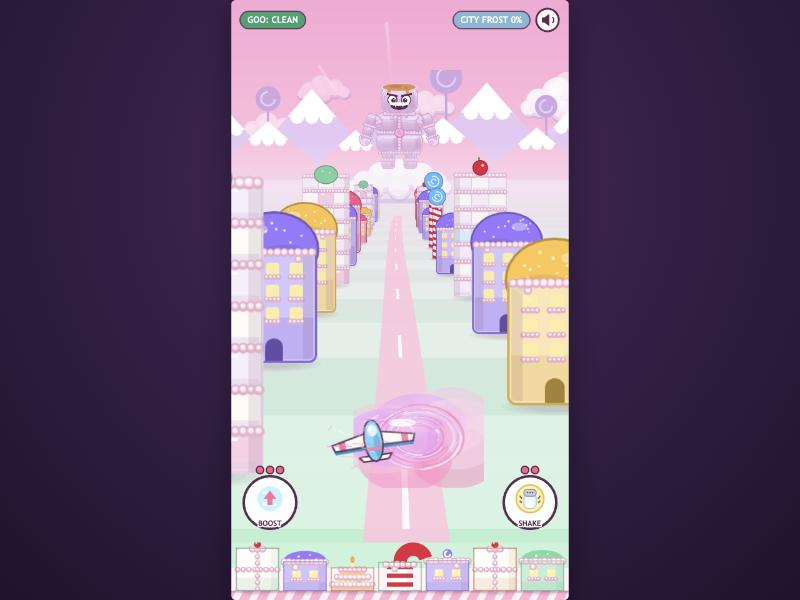
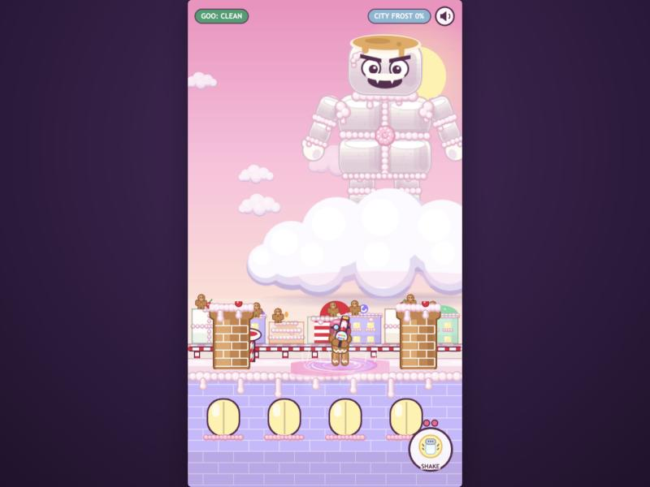
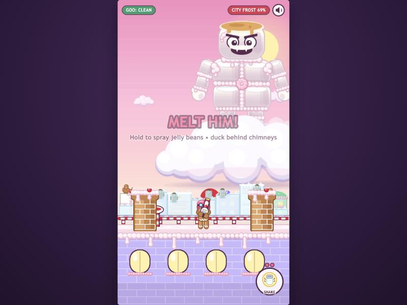
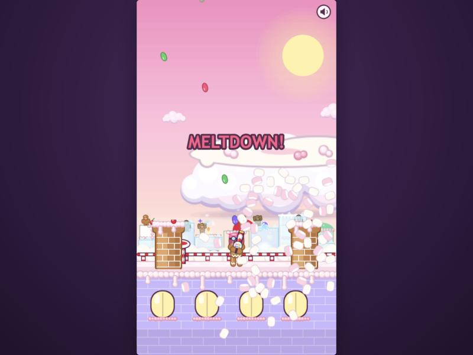
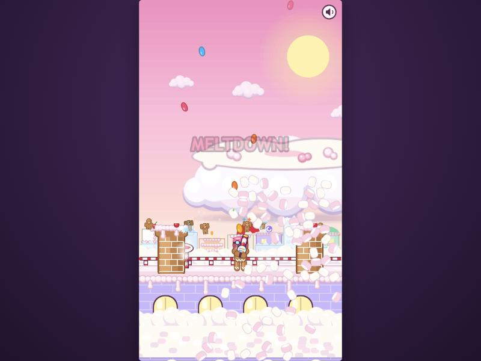
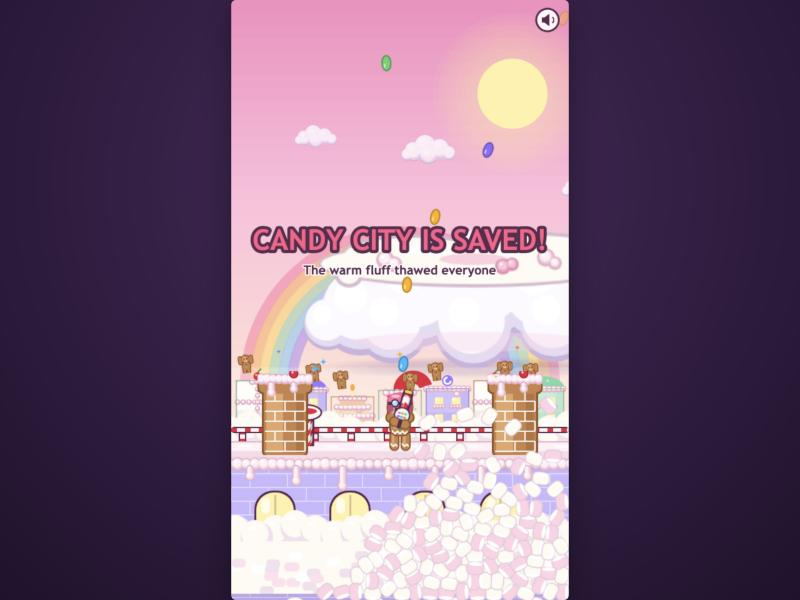
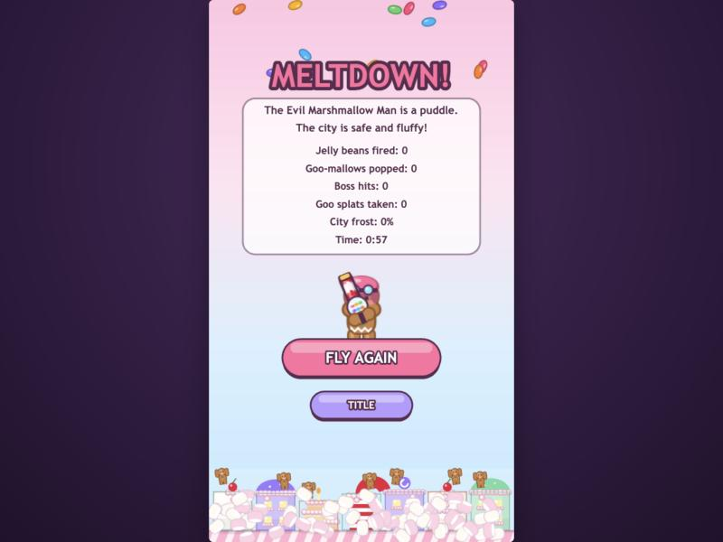

# prompt11 response — sticky traps and the flood (finale, part 2)

Implemented by Claude Code (Opus 5.5), 2026-10-02.

**What landed:**
- Cotton-candy sticky traps, in late flight and on the rooftop.
- The finale's flood, staged as the payoff: the city thaws building by building, gingerbread residents warm up and celebrate, a rainbow, then the score screen.
- An end-to-end bot balance pass, which also caught and fixed a real boss bug from prompt5.

## What changed

### Cotton-candy traps (`objects/CottonCandy.js`, one module for both places)

**The attack.** The boss flings a pink spun-sugar **blast** on a lob. While it flies, its **landing spot is marked with a pulsing ring** so you can see it coming. It bursts into a sticky zone that **lasts 8 s**, fading out over the last 1.2 s.

**Flight** (from 55% progress, every 7–10 s, about 2–3 per run):
- The distant boss throws at where the glider is heading.
- The zone is a **hanging spun-sugar cloud** on the flight plane: swirly pink fibres, glossy highlights, an ellipse about 185×130.
- Inside it the glider is **held**: its top speed drops to ×0.15 (`TUNE.trapHold`) and the pull toward your steering to ×0.2 (`TUNE.trapSpring`). Pink sticky strands cling to it.
- **A boost tears you free**, since boosting already ignores the speed cap. That's another double duty for BOOST.

**Rooftop** (every 7–10 s while he fights):
- The blast leaves his hand and lands as a **splattered sticky patch** on the roof, about 150 px wide.
- The pilot inside it runs at ×0.15 speed, but **can still shoot**.

**Distinct from goo:** no tiers, no mass, nothing to shake off. You're held while you're in it, and that's all.

**Trap plus goo:** being held means you can't dodge, so goo that's already incoming lands. That's the intended danger; the bot runs below show it stays fair.

### Residents (`objects/Residents.js`)

- A little **gingerbread resident** stands on each skyline building's roof (7, in the rooftop scene and on the end screen).
- They **freeze with their building's frost**: at ≥50% they're **encased in an ice block**, tinted icy and stock-still. Unfrozen, they bob and sway.
- In the finale each one **warms up and celebrates**: arms up, hopping, jelly-bean confetti.

### The flood finale, staged (`BossScene.finale`, about 8.8 s, non-interactive)

1. **MELTDOWN!** He melts away (the existing melt). His marshmallow **spills off the cloud**: fluff Matter bodies pour down and pile in the street below the roof.
2. **The flood rises**: a fluffy marshmallow surface surges up the streets behind the roof (up the skyline's lower floors, then settling) and fills the street below ours.
3. **It thaws the city from the middle out**: one building every 0.26 s, each with steam and sparkles and a chime (`Sfx.thaw`, using the new `City.thawOne`). **Each resident warms up and starts cheering** as their building thaws.
4. **Colour returns**: a **rainbow** fades in over the saved skyline and the banner reads **"CANDY CITY IS SAVED! — The warm fluff thawed everyone"**. The pilot hops and fires jelly-bean fireworks.
5. A white fade to the score screen. The **end screen** now shows **the gingerbread pilot cheering** (it showed the glider before) and **every resident still cheering** on the skyline. After a rooftop loss he droops, frosty.

### Bug found by the bot, and fixed (`MarshmallowMan.dropArm`)

**Symptom.** In one sloppy-bot run the boss **threw nothing for the whole of ARM OFF! and COLLAPSING**.

**Root cause.** If ARM OFF! triggers while he is mid-throw *with the arm that tears off*, `dropArm()` kills that arm's tweens. The throw's completion chain never runs, so `throwing` stays `true` and he never attacks again. This has existed since prompt5's arm detachment and only shows when the timing lines up.

**Fix.** Track which arm is throwing (`throwArm`) and free him if it's the one that drops.

**Proof:**
- I reproduced it deterministically: forced a left-arm wind-up, then pushed him into ARM OFF! mid-throw.
- **Old code: 0 throws in the next 4 s. Fixed: 4 throws.**

### Smaller changes

- `config.js`: `trapHold`, `trapSpring`.
- `sfx.js`: `ccFire`, `ccBurst`, `thaw`.
- `City.js`: `thawOne(i)`.
- `textures.js`: cotton cloud, roof patch, blast, strands, target ring, residents (×2 poses), ice block, flood surface, rainbow, all baked last.
- README updated.

## Verification

**Environment:** the in-app browser with the Vite dev server, 540×960 canvas. Frames were driven with `__game.loop.sleep()` + `__game.step()`. The rooftop was paced in real time (the boss's wind-ups are wall-clock tweens). `npm run build` is clean.

### The bot, end to end (launch → flight → bail-out → rooftop → flood)

**No cheats this time.** Earlier prompts' harnesses cleared goo and frost; this one doesn't. The bot only does what a player can:
- It sets the steering target (as a drag would), fires constantly, and presses BOOST/SHAKE.
- In flight, every 0.1 s it scores candidate positions against props, predicted goo paths, gate/bank lines, traps and incoming blast rings, and goes for pickups.
- It boosts when SPLATTERED or held over 0.6 s, and shakes when CAKED.
- On the roof it stays where its beans reach him, dodges predicted goo and patches, and shakes when CAKED.

**Two skill levels:**
- **skilled:** re-plans every 0.1 s.
- **sloppy:** re-plans every 0.33 s, ignores 35% of its chances to react, and never boosts out of traps.

All six runs below used the final code, with the fix:

| Run | Flight: splats / trap catches (held) / frost at the cloud | Roof: time, stage changes at | Roof throws by stage (at city) | Roof splats / shakes | Roof trap catches (held) | Frost peak | Result |
| --- | --- | --- | --- | --- | --- | --- | --- |
| skilled 1 | 1 / 0 / 16% | 37.5 s · 6.9 16.6 28.2 36.5 | 2 / 4 / 14 / 3 (0/1/3/2) | 4 / 1 | 4 (6.3 s) | 27% | **WIN** |
| sloppy 1 | 2 / 1 (0.4 s) / 14% | 38.2 s · 6.9 16.5 28.2 37.2 | 2 / 3 / 13 / 3 (0/1/3/0) | 7 / 2 | 3 (4.8 s) | 21% | **WIN** |
| skilled 2 | 1 / 0 / 16% | 36.2 s · 6.9 15.9 26.2 35.2 | 2 / 4 / 10 / 3 (0/2/2/2) | 6 / 2 | 6 (14.8 s) | 32% | **WIN** |
| sloppy 2 | 1 / 0 / 11% | 36.9 s · 6.9 16.4 26.9 35.9 | 2 / 3 / 12 / 3 (0/0/3/1) | 5 / 1 | 4 (5.6 s) | 18% | **WIN** |
| skilled 3 | 1 / 1 (0.6 s, boosted out) / 9% | 36.9 s · 6.9 15.9 26.9 35.9 | 2 / 3 / 13 / 3 (0/1/2/0) | 5 / 1 | 4 (8.7 s) | 16% | **WIN** |
| sloppy 3 | 0 / 1 (0.9 s) / 9% | 37.9 s · 6.9 16.2 28.8 36.9 | 2 / 4 / 14 / 4 (0/3/0/3) | 5 / 1 | 5 (9.8 s) | 27% | **WIN** |

**Timing:** each run takes about 42 s of flight (launch to the hand-over), about 37 s on the roof, then 8.8 s of finale before the End screen. That's about 1:30 to the score.

**Judgement:**
- **Winnable:** 6 of 6, at both skill levels.
- **Frost pressure sane:** the peak was 16–32%, with the flight contributing 9–16%. Prompt5's old arena peaked at 39%.
- **No stage spikes:**
  - On the roof, stages last about 7 s (PRISTINE, including the ~2 s parachute), then about 9–10 s, 10–12 s and 8–9 s.
  - **ARM OFF!**, the stage review-4 flagged, sends 0–3 of its 10–14 throws at the city. It adds only +2 to +9 points of frost across its ~11 s. No spike.
- **Trap plus goo is dangerous, not decisive:** on the roof the bots were caught 3–6 times per run. Splats there were 4–7, versus 0–2 in flight, and all six still won. The worst case was skilled 2, held 14.8 s in total: its planner kept fighting from inside patches to stay under the boss. Still a win at 32% frost.

**Earlier runs:**
- The first three skilled runs, with the old, weaker hold (×0.3), were also all wins (frost peaks 29 / 34 / 19%).
- The sloppy run that exposed the frozen-boss bug also still won, because a passive boss is easy, which is exactly why the "no throws" numbers stood out.

### Criteria

| Criterion | What I observed |
| --- | --- |
| Traps in flight | Screenshot 1: the pink blast leaving the distant boss, the ring marking its landing spot around the glider. Screenshot 2: the hanging spun-sugar cloud holding the glider (strands on it). Held, half a second of pulling left moved it only 73 px and it was still caught. A boost pops it out (skilled 3 boosted out after 0.6 s). |
| Traps on the roof | Screenshot 3: the patch around the pilot's feet. Measured speed inside: 108 px/s at the earlier ×0.3 hold, vs 430 clean. He kept firing. |
| Visibly sticky; dissipate on their own | The glossy spun-sugar mesh with pink and white fibres; strands on whoever is held. Each zone shrinks and fades after 8 s; none persisted past that in any run. |
| Flood finale plays and thaws the city | Screenshots 5–7: MELTDOWN! and the fluff spill; the flood rising, buildings thawing from the middle and residents cheering; **CANDY CITY IS SAVED!** with the rainbow. Logged: frost `[0.3, 0.9, 1.2, 0.6, 0.8, 1.1, 0.2]` → all 0, 7 of 7 residents celebrating. Screenshot 8: the end screen with the cheering pilot and residents. |
| A full bot run wins | 6 of 6 (table above). Each finale ran 8.8 s and ended on the End screen. |
| Zero console errors | The game logged none. The tab's console holds one entry: a **500 from the dev server** for `EndScene.js` while a half-edited version of that file was on disk mid-edit (Vite couldn't transform it). Every later load was 200. **Fresh tab, final code:** launch → full flight (3 traps, 9 gates and banks) → bail-out → rooftop (traps; all four stages, including ARM OFF!) → flood → End, with **zero console errors**. |

## Screenshots

| | |
| --- | --- |
|  |  |
| 1. Late flight: a cotton-candy blast incoming, its landing ring around the glider | 2. Caught in the hanging spun-sugar cloud |
|  |  |
| 3. Rooftop: a sticky patch holding the pilot | 4. Frosted buildings, their residents frozen in ice blocks |
|  |  |
| 5. MELTDOWN!: his marshmallow spills off the cloud | 6. The flood fills the streets; buildings thaw, residents cheer |
|  |  |
| 7. CANDY CITY IS SAVED!: rainbow, everyone cheering | 8. Score screen: the pilot and residents still celebrating |

## Deferred or skipped

- **The flood behind the roof is partly hidden** by the roof itself. The front flood (in the street below our roof) and the fluff pile carry most of the "flood" read.
- **Gallons of marshmallow** (DESIGN's score) still isn't a number on the end screen. The stats panel is unchanged.
- **The flight city strip has no residents.** They live on the rooftop scene's skyline and the end screen, where the payoff happens.
- **The PRISTINE stage is the shortest** (about 5 s of fighting after landing), because the blaster starts with a full hopper. It's not a spike, but if Finch wants more of the smug stage, start the hopper half full.

## Notes for the next prompt

- **DESIGN.md doesn't mention the traps yet.** They're a new boss attack (Kevin's design); Finch may want to add them to the boss section.
- **Tuning knobs:**
  - Traps: `TUNE.trapHold` / `TUNE.trapSpring` (one hold value for glider and pilot), lifetime and zone sizes at the top of `CottonCandy.js`, and cadence in `FlightScene.TRAPS_FROM` / `BossScene.TRAP_EVERY`.
  - Finale beats: `FLOOD_AT`, `THAW_AT`, `THAW_STEP`, `SAVED_AT`, `FINALE_END` in `BossScene.js`.
- **If the roof patches feel too sticky to humans, split the hold.** A pilot-only hold of about 0.3 was the original value; at that value the bots also won (frost peaks 29/34/19%). The 14.8 s worst case came from a planner that chose to stand in patches.
- **Harness:** a configurable end-to-end bot (`e2e({ replan, skip, escape })`) drove these numbers. It lives in the session scratchpad, not the repo; I can commit it under `tools/` if Finch wants it kept.
