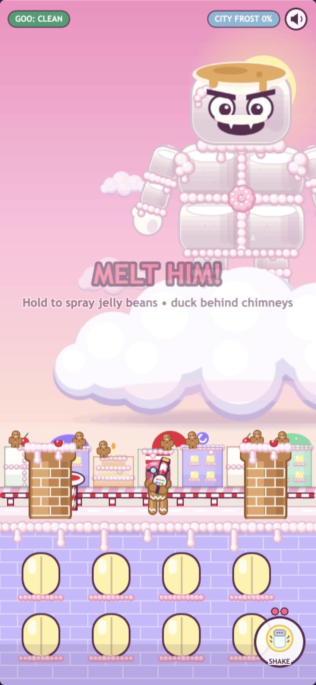
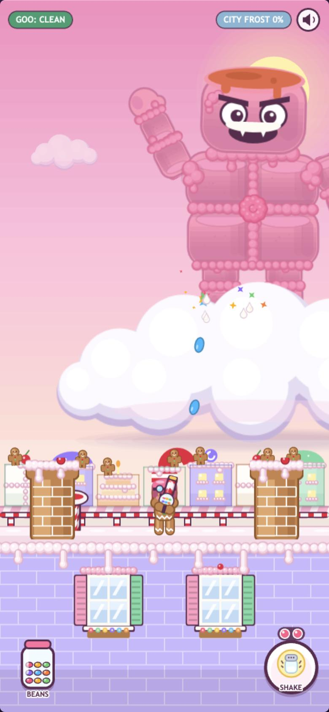
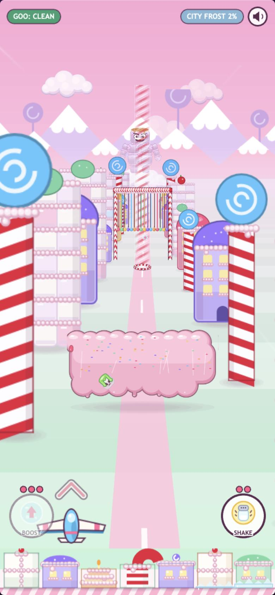
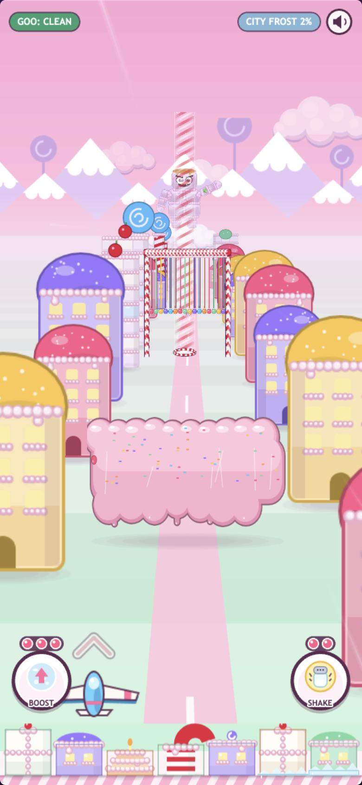
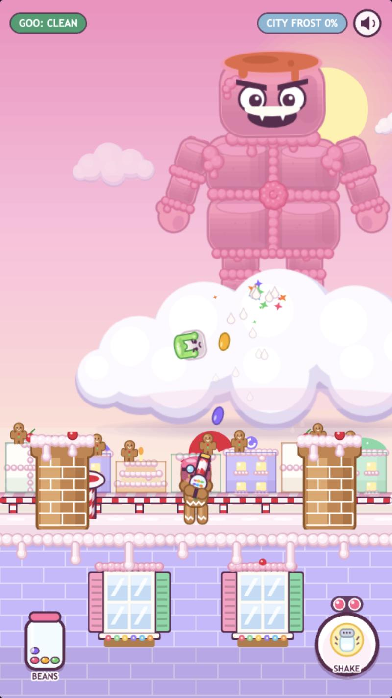
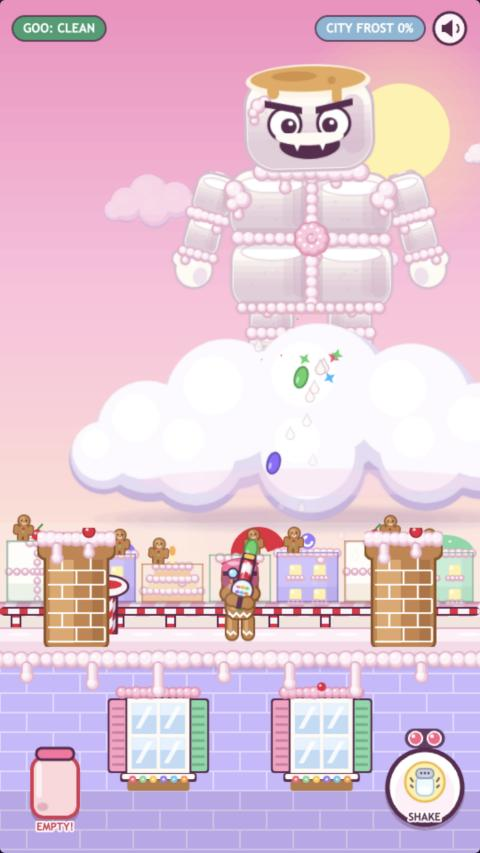
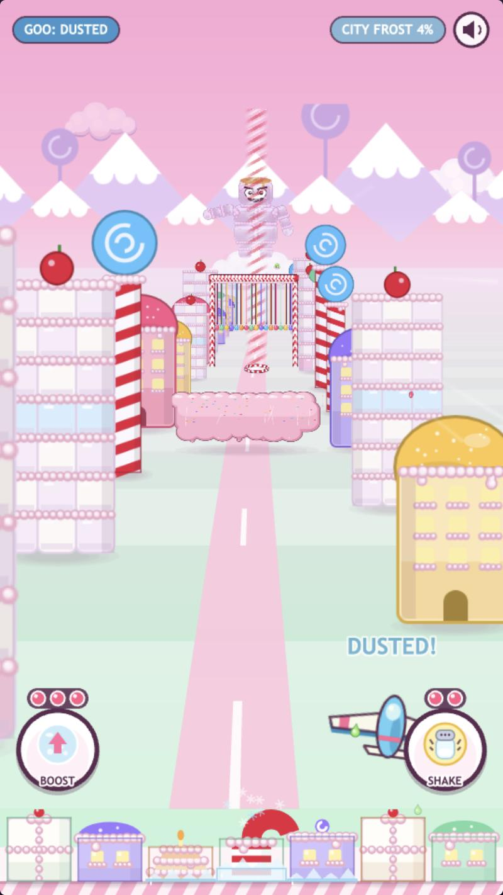
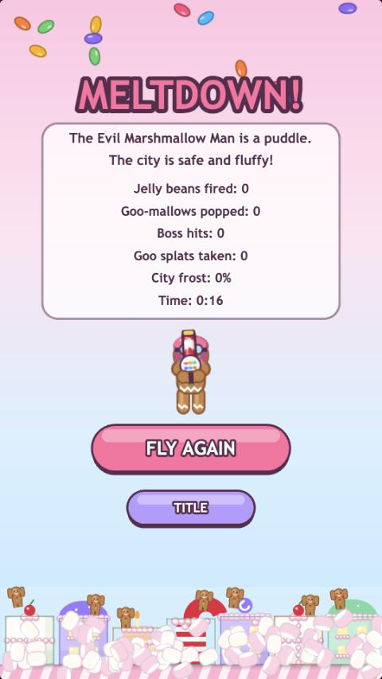

# prompt12 response — UI legibility pass (phone-first)

Implemented by Claude Code (Opus 5.5), 2026-10-02. Every check below was done at both aspects:
- **540×960**
- **Tall phone, 390×844 logical**: 19.5:9, iPhone-like, which gives the game's 540×1169 canvas.

Both used the browser pane's viewport emulation, and the screenshots are at device resolution.

## What was actually wrong

1. **Rooftop windows.** Eight lit yellow arched windows, in two rows of four, read as floating pills or buttons. At tall-phone size the bottom-right one sat directly behind SHAKE (`before-roof-tall`).
2. **"Flight controls hidden by art."** I audited draw order first. **Nothing decorative was ever drawn above the controls**: they sat at `DEPTH.hud` (60) and every piece of art was below it.

   The real cause was **translucency**:
   - Plates were 88% opaque.
   - Unavailable controls dropped to 40%.
   - Since prompt5, a control faded to **45%** whenever the glider's art was underneath it.

   So a big near-camera billboard or the glider passing behind BOOST/SHAKE showed straight through and swamped the control (`before-flight-tall`: BOOST washed out with the glider and art behind it). That's what reads as "covered by art" on a phone.
3. **The "hopper pips" were the SHAKE charge pips**: two 6 px dots. The blaster's hopper had **no readout at all**.

## What changed

### `src/ui/Hud.js`: controls are solid, always

- **Plate.** BOOST and SHAKE are drawn as an opaque plate with a drop shadow and a 5 px ink rim, at the top of the draw order, so nothing behind them can show through.
- **Unavailable state** (no charges, or can't act right now): the plate stays opaque and only the **icon and label grey out**.
- **The 45% "glider underneath" fade is removed.** Controls win: if the glider flies into a bottom corner, its wingtip goes *under* the button (it stays steerable, and its hitbox is unchanged).
- **Charge pips:** 7.5 px (was 6), on a dark backing pill, with filled pips pink and highlighted and empty ones dim. They read against any background.
- **New on the rooftop: a BEANS hopper jar** in the bottom-left corner, which BOOST had before (BOOST isn't used on foot).
  - It's a gumball jar that fills with up to 12 coloured beans. The bean currently refilling fades in, so the 3/s trickle is visible.
  - When it's empty the jar **flashes red and reads EMPTY!**
  - It's display-only and jar-shaped, deliberately unlike the round buttons.

### `src/objects/Rooftop.js`: windows are architecture

- **The window:** a framed sash window with four panes of pale blue glass and glints, white mullions, a frosting lintel with a cherry keystone, slatted candy-coloured shutters, a sill and a flower box. No glow, no pill shape. It can't be mistaken for an indicator.
- **The layout:** two windows in the **middle** of the facade, at 33% and 67% of the width, one row (a second row only fits on canvases taller than these). **Both screen corners are plain brick**, so nothing decorative sits where controls live. The right window ends 14 px short of the SHAKE plate.

### `src/scenes/EndScene.js`: a related overlap found during the audit

- The prompt11 end-screen pilot stood on top of the FLY AGAIN button, and at 960 his blaster tucked under the stats panel.
- He's now scaled 1.2 (was 1.5) and stands just above the button: his lowest point is at y 591 vs the button top at 598.
- The glider (other end screens) was also lifted clear of the button.

### Small changes

- `Pilot.js`: `hopperMax` getter for the HUD.
- **Working notes** (per the prompt, not DESIGN.md): `prompts/README.md` gained a "Working notes (UI rules)" section:
  - interactive on top and solid in every state;
  - decorative art never looks interactive;
  - the two-aspect screenshot check before a prompt is done.
- README updated.

## Verification

**Visual**, at both aspects. Screenshots are below:
- Tall-phone before/after for the rooftop and flight.
- 960 after for the rooftop, the hopper's EMPTY state, the flight and the end screen.

**Occlusion audit** (automated, run in the page). Throughout a full flight (launch → valley → bail-out), the rooftop fight (traps and all four stages) and the finale, every 20 frames:
- For **every enabled input zone**, it listed every visible object drawn at or above the controls' layer (depth ≥ 60) that isn't part of a control.
- It flagged any whose bounds intersect a control.

| Aspect | Scene | Samples | Occluders |
| --- | --- | --- | --- |
| 540×1169 (tall phone) | Flight, incl. bail-out | 101 | **0** |
| 540×1169 | Rooftop + finale (3 traps fired) | 119 | **0** |
| 540×1169 | End | 1 | **0** (2 zones) |
| 540×960 | Flight, incl. bail-out | 105 | **0** |
| 540×960 | Rooftop + finale (2 traps fired) | 107 | **0** |
| 540×960 | End | 1 | **0** (2 zones) |

The only things ever drawn at or above the controls' layer are:
- the HUD chips;
- the centre banners (MELT HIM!, stage names, THE CLOUD!, CANDY CITY IS SAVED!);
- the parachuting pilot during the bail-out, while the controls are disabled.

None of these intersect a control.

| Criterion | What I observed |
| --- | --- |
| Windows read as windows | `after-roof-tall`, `after-roof-960`: framed, shuttered, paned, with a sill and flower box; corners plain brick. |
| SHAKE, pips and boost fully visible and unoccluded | `after-flight-tall`: the glider's wing under BOOST and a pink building behind SHAKE; both buttons solid (`boostBtn.bg.alpha` measured **1** with the glider underneath; it was 0.45 before). `after-flight-960`: the glider under SHAKE, solid. Audit: 0 occluders anywhere. |
| Hopper legible at a glance | The BEANS jar shows 9/12 (`after-roof-tall`), 4/12 refilling (`after-roof-960`), and EMPTY! in red (`after-hopper-empty-960`). |
| No decorative art overlapping any control | Audit table above; the end screen too (pilot clear of FLY AGAIN). |
| Zero console errors | None in the session that ran all of the above. `npm run build` is clean. |

## Screenshots

| Before | After |
| --- | --- |
|  |  |
| Rooftop, tall phone: yellow "pills", one behind SHAKE, tiny pips, no hopper readout | Framed windows mid-facade, plain corners, solid SHAKE with big pips, BEANS jar |
|  |  |
| Flight, tall phone: BOOST washed out to 45% with the glider and art behind it | BOOST solid with the glider underneath; SHAKE solid over a passing building |

| | |
| --- | --- |
|  |  |
| Rooftop, 540×960 | Hopper empty: the jar flashes red, EMPTY! |
|  |  |
| Flight, 540×960: the glider under SHAKE, the button solid on top | End screen: the pilot clear of the panel and FLY AGAIN |

## Deferred or skipped

- **The glider can still fly under a corner button.** Controls are now opaque and on top, so its wingtip is hidden there instead of the button being washed out. That's the tradeoff the prompt asks for. Keeping the glider out of the corners entirely would mean tightening its flight bounds, which is a mechanics change I didn't make.
- **No in-world hopper readout on the blaster itself.** The jar is the at-a-glance read. The gun's gumball sphere is too small on a phone to carry a count.
- **The SHAKE charge pips are still above the button** (now big and backed). Kevin read them as hopper ammo, so it's worth watching whether the BEANS jar next to them clears that up.

## Notes for the next prompt

- review-7's suggestions (gallons-of-marshmallow score, PRISTINE/hopper tuning, flood visibility, committing the e2e bot to `tools/`) weren't in this prompt and are untouched.
- If the bot gets committed, the occlusion audit used here would make a good companion check. It's about 30 lines that walk the display list against the enabled input zones.
