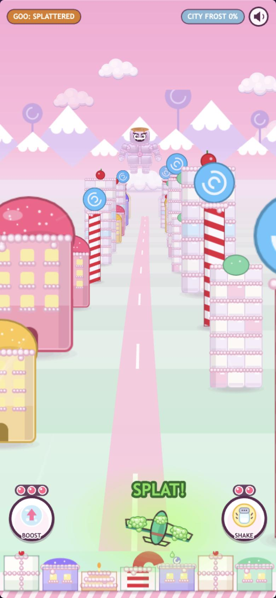
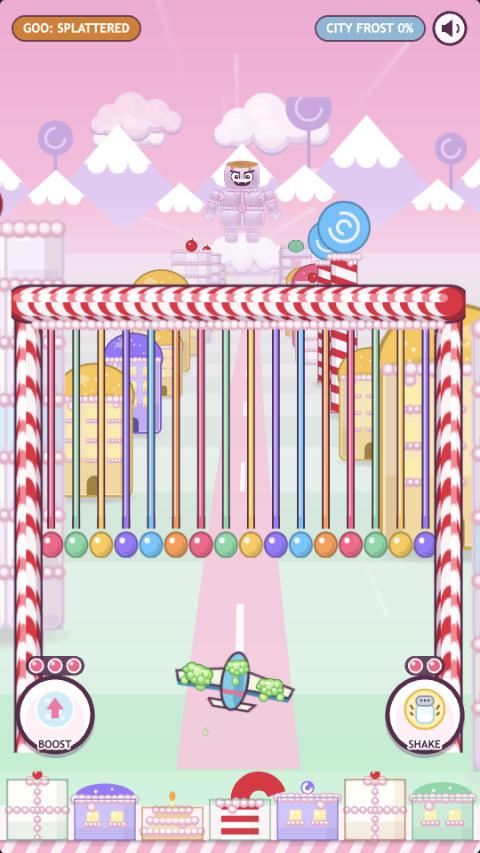
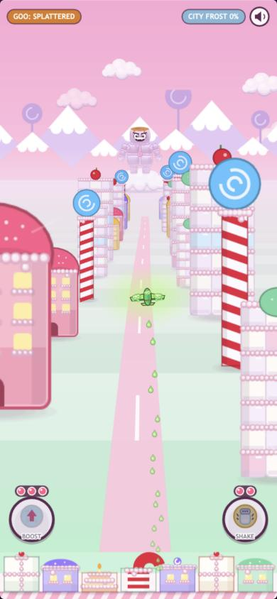
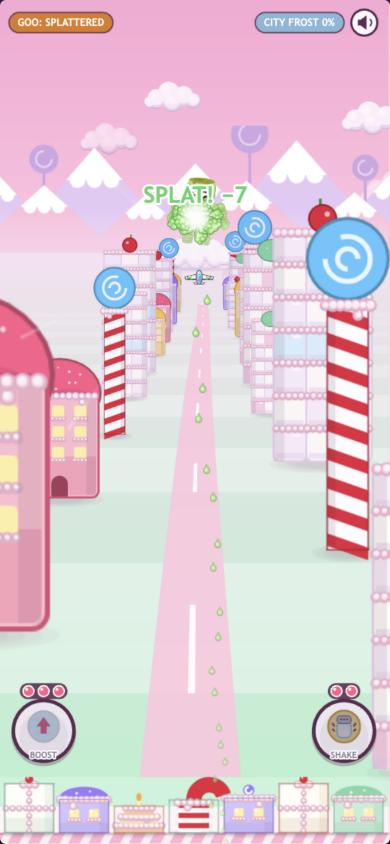
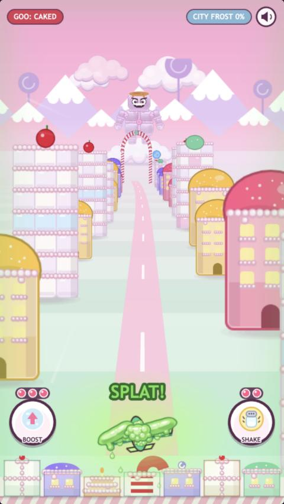
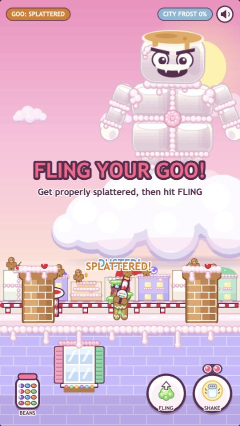
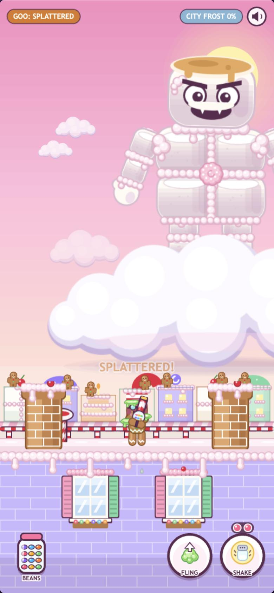
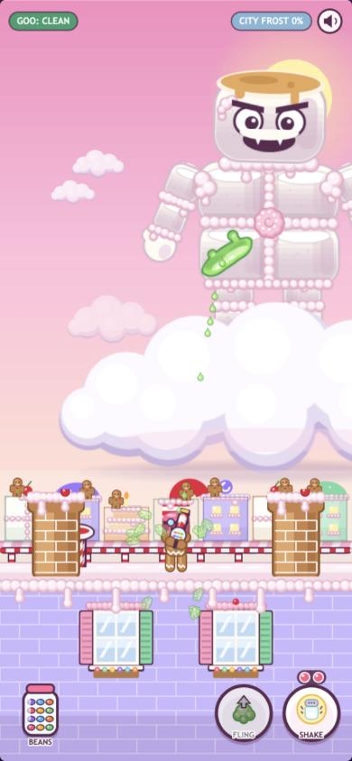

# prompt13 response — fly dirty (the goo inversion experiment)

Implemented by Claude Code (Opus 5.5), 2026-10-02.

## Verdict first

**The inversion works, but as tuned it is not a risk/reward loop. Flying dirty is simply the better way to play.** Across 12 end-to-end bot runs, everybody won.

| | Dirty bot (4 runs) | Clean bot (4 runs) |
| --- | --- | --- |
| Total time | **65–72 s (mean 67.9)** | 78–81 s (mean 79.2) |
| Spread | 6.2 s | 2.2 s |
| City frost (peak) | **5–14%** | 27–33% |
| Goo splats taken | 9–12 | 3–5 |

The prompt predicted dirty would be faster with higher variance, and it is (speed, spread and splat counts). **But frost goes the other way.** Dirty is also much kinder to the city, so **dirty beat clean on every measure in every run.** Clean was never the better choice.

**Why:**
- Goo you catch is goo that doesn't land on the city. DESIGN already says "all defense leaves you goo'd"; the inversion now pays you a second time for that defense.
- Carried goo does cost mass, list and sink, but that doesn't hurt a bot that steers by plan.
- Spending as soon as you're loaded means you're rarely CAKED, so the death spiral never comes close.

**The one real gamble the bots found is *how* dirty, not *whether*.** A "greedy" variant that waits for CAKED (17 damage instead of 7) mostly lost its goo to drip and trap-escape boosts before it got there. Three of four greedy runs never reached CAKED in flight and finished slower than the eager dirty bot (72–73 s). The one that did was the fastest run of all (65.3 s).

**Caveat:** bots have perfect information. For a human, steering *into* goo while also dodging gates and holding a 0.8 s dive under fire may carry real execution risk. These runs can't measure that. Per the prompt I did **not** tune around the result. Options for Finch and Kevin are at the end.

## What changed

### The rule: loaded = SPLATTERED or CAKED

`glider.loaded` / `pilot.loaded`. DUSTED is a graze and doesn't count.

### Flight: the dive-bomb (`Glider.js`, `Controls.js`, `FlightScene.js`)

**Holding a dive** means keeping the steering pushed down past the floor. Specifically:
- At least 50 px of steering pushed past the floor (`TUNE.divePush`)...
- ...held for 0.8 s (`TUNE.diveArm`) while loaded...
- ...with the finger still down (or Down/S held).

**What can't trigger it:**
- **Goo sinking you to the floor:** it moves the target without pushing, so it never counts.
- **A quick dip under a gate:** it decays well before the 0.8 s.

**The cue:** a green glow builds while you hold. When armed, the glider pulses green and a big **SPLAT!** appears above it.

**Commit:** let go, or pull back up. It's the slingshot's "pull down, let go" gesture again.

**The goo comet:**
- The glider streaks to the boss on the horizon (0.55 s), shrinking into the distance and trailing slime.
- It splats him: goo explosion, camera shake, he flinches and tints green, "SPLAT! −7".
- It bounces back to its cruise row **clean** (1.05 s).
- About 1.6 s out of action: no steering, firing or cleanses, and it can't be hit. The BOOST/SHAKE buttons grey out.

**Damage** goes into **one boss HP pool for the run** (`run.bossHp`):
- SPLATTERED **7**, CAKED **17**, the mid-points of the prompt's ranges (`TUNE.splatDamage`).
- The flight is capped at **25** (`TUNE.flightSplatCap`, one stage), so he arrives on the roof at worst SAGGING.
- Hitting the cap shows **"HE'S SAGGING! — Finish him on the roof"** and his eyes droop on the horizon. Further comets still clean you but deal nothing ("SAVE IT FOR THE ROOF!").

**First-time banner per run:** the first time you're loaded, **"HOLD YOUR DIVE — to splat your goo at the boss!"**

### Rooftop: FLING (`Hud.js`, `Pilot.js`, `BossScene.js`)

- **The button:** a round button beside SHAKE. The icon is a goo glob with an up-arrow; the label is FLING.
- **When it works:** only while loaded. Otherwise it's greyed on its solid plate, per prompt12's rule. When live, the icon breathes. The keyboard shortcut is F.
- **What it does:** the pilot hurls all his goo in one glob that arcs into the boss's chest (0.6 s, dripping) for the same tier-scaled damage ("SPLAT! −17"), and comes up clean.
- **First goo on the roof per run:** the banner **"FLING YOUR GOO! — Get properly splattered, then hit FLING"**.
- **Shared HP:** the boss starts the roof at whatever HP the run carries (`MarshmallowMan.startAt`, which quietly sets his starting stage).
- **Windows:** they now keep clear of every control slot (`roofSlots()` is shared by the HUD and the roof). On the 960 canvas that leaves one window, left of centre; on the tall phone, two.

### Unchanged

- Bean damage is still 1 per hit.
- Tiers, cleanse rules, controls, speeds and spawn pressure are untouched.
- Boss HP (100) and stage thresholds are unchanged.
- The inversion only *adds* a route.

### DESIGN.md

The goo section gains **"Fly dirty: carried goo is ammo (experimental)"**: loaded tiers, the dive-bomb, FLING, damage and the flight cap, the shared pool, the teaching banners, and a **playtest-status line pointing here**.

## Verification

**Environment:** the in-app browser with the Vite dev server, at 540×960 and a 390×844 tall phone (540×1169 canvas). Frames were driven with `__game.loop.sleep()` + `__game.step()`; the rooftop was paced in real time. `npm run build` is clean.

### Input checks (real `TouchEvent`s on the canvas, tall phone)

| Case | Result |
| --- | --- |
| Clean glider pushing hard into the floor for 1.5 s | Charge stays 0 (not loaded). |
| Loaded, goo sinking it to the floor, finger held still | Push 0, charge 0. Never arms. |
| Loaded, quick dip (push past the floor, 0.4 s, back up) | Charge peaked at 0.52 and decayed. No comet. |
| Loaded, pushed and held 0.9 s | Armed (charge 1, SPLAT! visible). Lifting the finger launched the comet. On impact `run.bossHp` 100 → 93 and the glider was clean (goo 0). |
| Loaded glider diving under a gate the normal way (`4-loaded-gate-dive-no-cue-960`) | No glow, no cue, charge 0. |
| FLING by touch | SPLATTERED: boss 100 → 93. CAKED: 93 → 76. Pilot clean, button greyed. |
| First-time banners | "HOLD YOUR DIVE" on first loaded in flight. "FLING YOUR GOO!" on the first goo on the roof (through the real goo-hit path). Each once per run (`run.tips`). |

### The experiment (end to end, no cheats)

**The bots:**
- **clean:** prompt11's skilled bot. Avoids goo, beans only, cleanses (BOOST at SPLATTERED, SHAKE at CAKED), never dives or flings.
- **dirty:** the same planner, but goo paths and frosting banks *attract* it while unloaded. The moment it's loaded (and no gate is due) it holds a dive through the real input path (`controls.steerId` held, steering pushed past the floor) and lets go when armed. On the roof it stands where goo will land until loaded, then FLINGs at once. Never cleanses (except boosting out of a cotton-candy trap).
- **greedy** (extra): the dirty bot, but it only spends at CAKED.

| Run | Total | Flight: comets (dmg), splats, frost at cloud | Roof: start HP, time, flings, roof splats | Goo dmg | Frost peak |
| --- | --- | --- | --- | --- | --- |
| dirty 1 | **65.7 s** | 2 (14), 5, 0% | 86, 23.6 s, 3, 7 | 35 | **5%** |
| dirty 2 | **65.3 s** | 4 (25, capped), 8, 5% | 75 (SAGGING), 23.2 s, 2, 4 | 39 | **14%** |
| dirty 3 | **69.0 s** | 2 (14), 5, 3% | 86, 26.9 s, 2, 4 | 28 | **14%** |
| dirty 4 | **71.5 s** | 1 (7), 5, 2% | 93, 29.4 s, 3, 6 | 28 | **5%** |
| clean 1 | 80.5 s | 0, 0, 13% | 100, 38.8 s, —, 3 | 0 | 31% |
| clean 2 | 79.6 s | 0, 1, 14% | 100, 37.5 s, —, 3 | 0 | 29% |
| clean 3 | 78.3 s | 0, 1, 13% | 100, 36.2 s, —, 4 | 0 | 33% |
| clean 4 | 78.3 s | 0, 1, 13% | 100, 36.2 s, —, 4 | 0 | 27% |
| greedy 1 | 72.3 s | 0 (never CAKED; 4 trap boosts shed goo), 5, 2% | 100, 31.2 s, 1 (17), 6 | 17 | 11% |
| greedy 2 | 73.3 s | 0, 5, 2% | 100, 31.2 s, 1, 7 | 17 | 12% |
| greedy 3 | 65.3 s | 1 CAKED (17), 7, 0% | 83, 23.2 s, 1, 5 | 34 | 14% |
| greedy 4 | 72.3 s | 0, 4, 2% | 100, 30.2 s, 1, 5 | 17 | 7% |

**How these map to the prompt's questions:**

- **Both win:** yes, 12 of 12.
- **Dirty faster on average:** yes. Mean 67.9 vs 79.2 s (−14%), all of it on the roof (25.8 vs 37.2 s). The flight's length is time-based; comets only add a small head start.
- **Higher variance:**
  - Time: yes (range 6.2 vs 2.2 s).
  - Splats: yes (9–12 vs 3–5).
  - Frost: **no.** Dirty's frost is *lower* (5–14% vs 27–33%), because the goo it catches never reaches the city.
- **Is clean strictly better in any run?** No. **Dirty was strictly better than clean in every pairing**, on both time and frost. That is the failure mode the prompt *didn't* list, and it still means the loop isn't a real risk/reward choice.

### Other criteria

| Criterion | Result |
| --- | --- |
| Arming cue unmistakable vs a gate dive, both aspects | Armed: `1-armed-tall` (SPLATTERED) and `5-armed-caked-960` (CAKED), with green pulse, halo and SPLAT!. A loaded gate dive shows nothing: `4-loaded-gate-dive-no-cue-960`. Comet: `2-comet-tall`, impact `3-comet-impact-tall`. |
| FLING at both aspects | `7-roof-fling-tall` (loaded, two windows clear of the controls), `8-fling-glob-tall` (glob in the air), `6-roof-fling-tip-960` (tip banner, one window). |
| Controls never occluded (prompt12's rule, with the new button) | Occlusion audit on the roof at 960 with FLING in use: 42 samples, 3 zones (FLING, SHAKE, mute), **0 occluders**. |
| Zero console errors | None in the tab that ran all of the above. |

## Screenshots

| | |
| --- | --- |
|  |  |
| 1. Armed (tall phone): green pulse, halo, SPLAT! | 4. Loaded but just diving under a gate: no cue (960) |
|  |  |
| 2. The goo comet streaking to the boss, trailing slime | 3. Impact: "SPLAT! −7"; the glider bouncing back clean |
|  |  |
| 5. Armed while CAKED (960) | 6. Roof: the first-goo tip, FLING live (960) |
|  |  |
| 7. Roof, tall phone: FLING beside SHAKE, windows clear | 8. FLING: the glob arcing into him, the pilot clean |

## Deferred or skipped

- **I didn't tune around the result** (per the prompt). Damage stays at the range mid-points (7/17) and the flight cap at one stage.
- **The flight still lasts ~42 s regardless of comets.** Progress is time-based, so dirty's speed comes entirely from the roof starting with less HP and FLING bursts.
- **There's no human playtest of the dive-hold under pressure.** That's where any real risk would live, and bots can't show it.

## Options for Finch and Kevin (not implemented)

To make dirty a gamble rather than a dominant strategy, the cost has to bite. Ordered from smallest to biggest change:

1. **Spending pays the city a cost.** A comet's or fling's splash rains a little frost on the city (for example a third of a goo-mallow per spend). "Dirty" then trades city safety for boss damage: a real fork.
2. **An armed glider draws fire.** While charging or armed, the boss's next throw homes on you, which makes the 0.8 s hold genuinely dangerous.
3. **Lower payoff.** Use the low ends (6/15) or a smaller flight cap (≈15). This narrows the gap but doesn't create risk on its own.
4. **Accept it as the expert route.** If humans find seeking goo and holding the dive hard, then "faster if you can execute it" is a fine skill-game shape. That needs a human playtest to decide.
