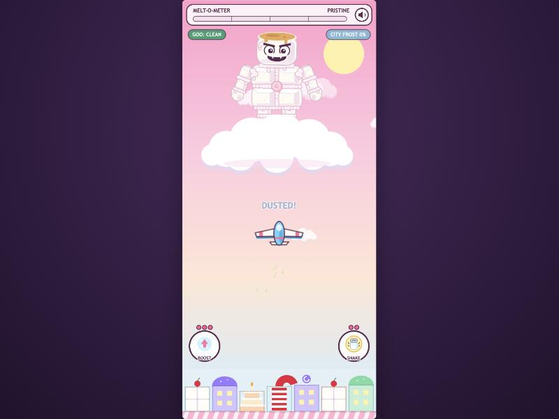
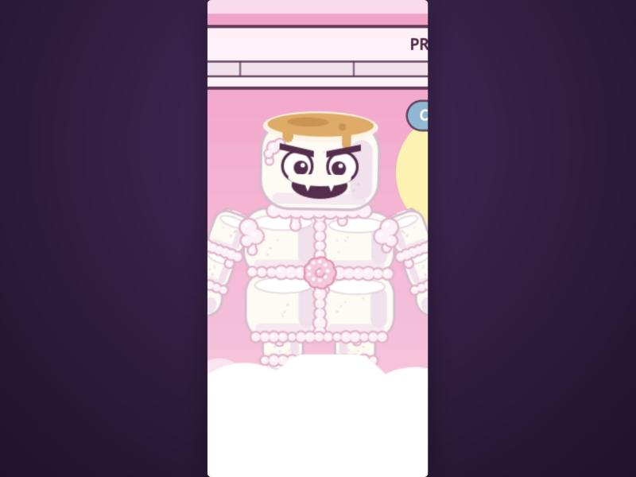
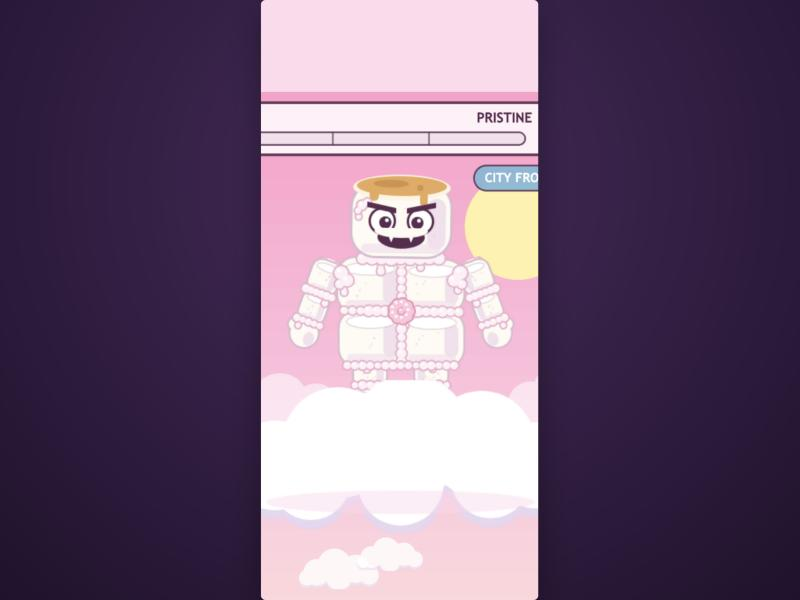
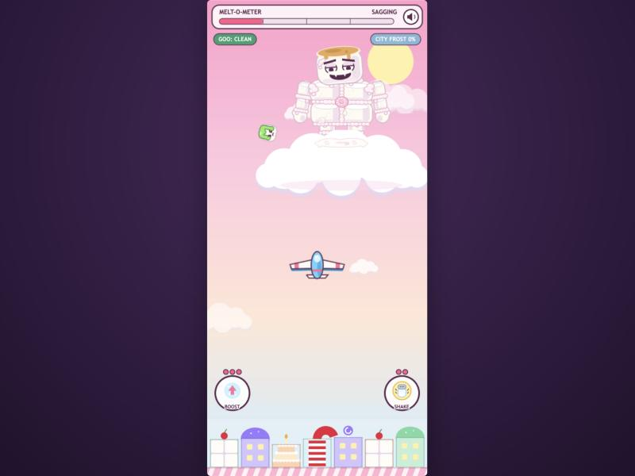
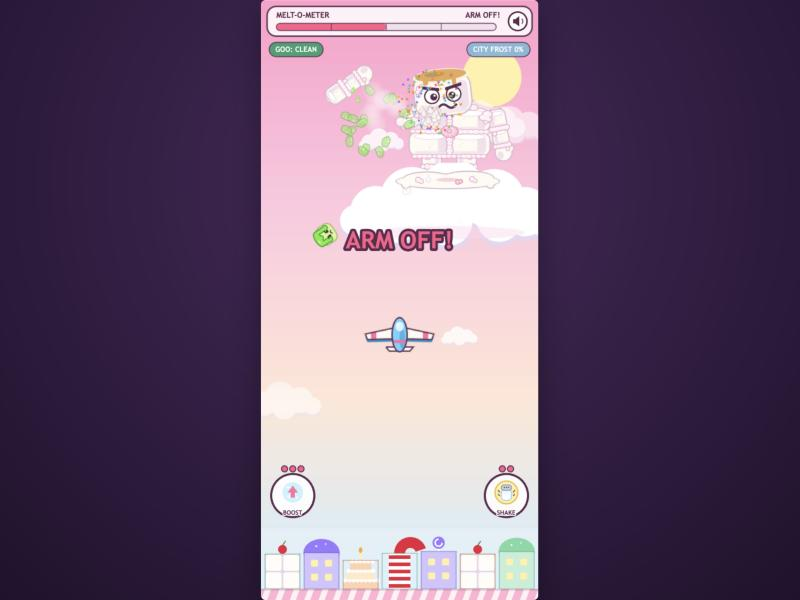
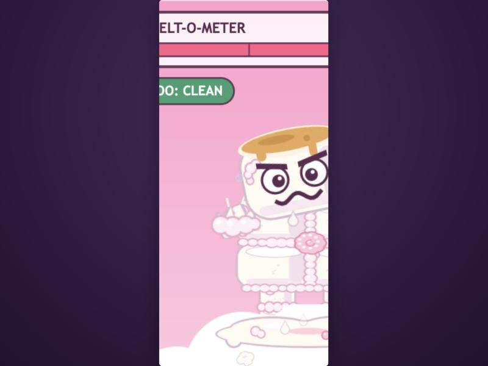
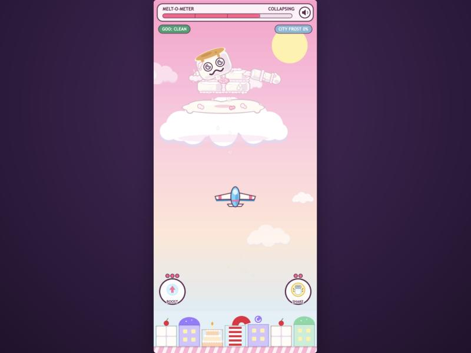
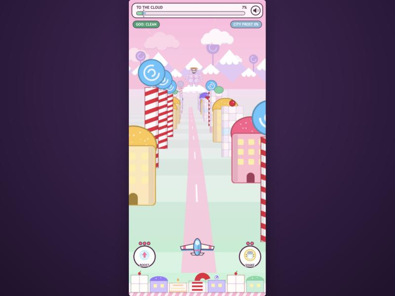
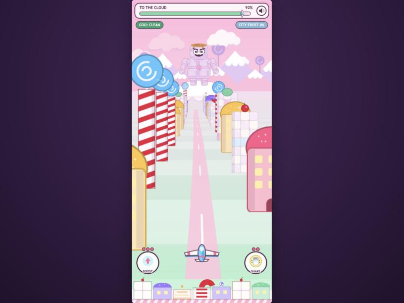

# prompt6 response — the boss, rebuilt from marshmallows

Implemented by Claude Code (Opus 5.5), 2026-10-02. A re-skin, not a re-rig. The rig, pose,
tweens, hitboxes, arm detachment, stage behaviours, HP thresholds, damage and goo numbers are
untouched (verified below).

## What changed

- **`src/art/textures.js` (boss parts redrawn)**
  - Every part texture keeps its exact size (`boss_body` 180×164, `boss_head` 144×124, `boss_arm` 56×124, `boss_leg` 60×66). Rig origins, shoulder positions, the hand reach used for throws, and hitboxes therefore line up exactly as before.
  - **New drawing helpers:**
    - `lump()`: one marshmallow, a slightly squashed rounded cylinder with a lighter top face (with a faint rim), soft side and base shading, and powder specks.
    - `frost()` / `beads()`: piped frosting, glossy pinkish-white beads drawn as one seamless line, with an outline pass, a fill pass and a highlight pass.
    - `frostDrip()`: frosting drips.
    - `rosette()`: a piped pink rosette.
  - **Body:** four big marshmallows (slightly different sizes and offsets) glued into the torso.
    - Frosting mortar runs along the vertical and horizontal seams.
    - Joints: a frosting collar at the neck (peeking out under the head and dripping down the chest), frosting blobs at both shoulders where the arms attach, and a waist band over the tops of the legs.
    - The flat pink belly swirl is replaced by a piped pink rosette where the seams cross.
    - The overall silhouette is still a rounded block, so he reads at distance.
  - **Head:** still one big marshmallow with the toasted golden-brown top (kept as-is), now with base shading, powder specks and a frosting smear on his left temple. The brows and toothy grin are separate textures and unchanged.
  - **Arm:** upper-arm lump, frosting ring at the elbow, forearm lump, frosting ring at the wrist, then a mitten hand plus thumb, with drips at both joints. The shoulder end carries a torn frosting cap. It's hidden behind his body while attached, but shows on the flung arm at ARM OFF!.
  - **Leg:** thigh lump, frosting at the knee with a drip, then shin lump.
  - **New `boss_stump`:** torn marshmallow (a jagged edge with stringy strands) over frosting dollops and drips.
  - **Puddle:** gains a few white and pink frosting dollops.
- **`src/objects/MarshmallowMan.js`:** one line. The rig's stump sprite now uses `boss_stump` at 1.25× scale (previously the generic `msplat` blob, which the sloughing-chunk particles still use). No other change.
- **Sprite count unchanged:** all detail is baked into the existing part textures at boot, so there are no extra sprites or draw calls per frame.

## Verification

Environment and method:
- Claude desktop in-app browser, Vite dev server, booted under mobile emulation (portrait 540×1169 canvas). Screenshots were taken at the pane's desktop size, where the portrait canvas is letterboxed.
- Frames were driven with `__game.loop.sleep()` + `__game.step()` at a 16 ms pace.
- Stages were reached through the real damage path (`boss.hit()`, 25 per stage).
- During observation the glider's goo was cleared and city frost zeroed each frame, so the run couldn't end. That's harness only.
- Close-ups used a temporary camera zoom (`cameras.main.setZoom`), reset afterwards.

| Criterion | What I observed |
| --- | --- |
| Reads as marshmallows + frosting mortar | Close-up (2): four torso lumps with visible top faces, piped seams, a neck collar, shoulder blobs, waist band, rosette, temple smear; arms with elbow and wrist rings (3). At actual arena size (1) the segmentation and seams are clearly visible. |
| Horizon (small) scale | Flight scene at boss scale 0.24 (8): a tiny figure whose silhouette, toasted top and face read, and whose lumps show as subtle texture rather than noise. At scale 0.53 near the end of the flight (9): segmented torso, seams, rosette and jointed arms all readable. |
| Arena (large) scale | (1) as played, (2) and (3) zoomed. |
| Melt stages still read | SAGGING (4): the lump art squashes cleanly with the existing pose, droopy eyes, small puddle. ARM OFF! (5): the flung arm shows its lumps and frosting rings, with the goo burst. Stump close-up (6): torn strands over frosting. COLLAPSING (7): squashed lumps, dizzy eyes, big puddle with frosting dollops. |
| Behaviours unchanged | Logged attacks: PRISTINE plain aimed throws; SAGGING burst bombs (3 lobs, 2 bursts observed in 5.5 s); ARM OFF! 3 swats in 5 s when close (12 swat globs) plus plain wild throws; COLLAPSING plain drooping lobs with 0 swats. `git diff` shows no behaviour code touched. |
| HP thresholds unchanged | Stage changes at hp 75 / 50 / 25. |
| Hitboxes unchanged | Measured sensor bounds 153×255, 162×230, 162×208, 179×157: the `HITBOX` table × 0.85, identical to prompt5's measurements. |
| Zero console errors | None across both scenes. `npm run build` clean. |

## Screenshots

| | |
| --- | --- |
|  |  |
| 1. Arena scale, as played (PRISTINE) | 2. Arena close-up: lumps, seams, collar, rosette |
|  |  |
| 3. Full figure: jointed arms and legs | 4. SAGGING |
|  |  |
| 5. ARM OFF!: the arm flung with a goo burst | 6. Stump close-up: torn marshmallow + frosting |
|  |  |
| 7. COLLAPSING over the frosted puddle | 8. Horizon scale early in the flight (0.24) |
|  | |
| 9. Horizon scale late in the flight (0.53) | |

## Deferred or skipped

- **The head stays one big marshmallow** rather than several lumps. It is a single marshmallow by design (the toasted top only makes sense on one), and splitting it would fight the face textures, which are positioned on that head.
- **Neck joint is drawn on the body texture.** Head and body are separate sprites with only a 12 px overlap. The frosting collar shows below the head's edge and drips down the chest, rather than wrapping around the neck.
- **No new textures for the eyes or mouth.** The prompt asked to keep the brows and grin.

## Notes for the next prompt

- **The helpers can be reused.** `lump()`, `frost()`, `beads()`, `frostDrip()` and `rosette()` sit in `textures.js` and could dress other candy props (e.g. frosting on the city buildings, or "residents" from DESIGN.md).
- **Still open from earlier responses:**
  - Shake window (0.9 s vs DESIGN ~1.5 s).
  - HUD bars vs DESIGN's "no HUD bars".
  - Distant goo hitbox size in Flight.
  - ARM OFF! city-frost pressure.
