# prompt7 response — paint the world

Implemented by Claude Code (Opus 5.5), 2026-10-02. This is an art-only lighting and atmosphere pass. Everything is still procedural and drawn once into textures at boot. Hitboxes, behaviours, numbers, staging and mechanics are untouched. Per-frame cost went **down**, not up (measured below).

## What changed

### `src/art/textures.js`

**New lighting helpers** (next to prompt6's):
- `litBody()`: a marshmallow body lit from above. It has a stacked top-light gradient (darker towards the base), shading on the right side, and a soft white specular arc on the upper left. `lump()` now uses it, so every boss lump is lit.
- `aoLine()` / `aoDot()`: soft ambient-occlusion darkening, built from stacked low-alpha strokes.
- `contactShadow()`: a soft drop shadow made of stacked low-alpha ellipses.
- `frost()` (rewritten): piped frosting is now glossy. It has an outline pass, a shaded body, a lit body offset up and left, a white specular dot and a glint.
- `wetGoo()`: glossy slime. It has a dark lower edge, lighter translucent-looking cores, a specular streak with glints, and a trapped bubble.
- `cloudPuffs()`: layered cloud puffs. Each one has a lilac shaded underside, the body, a lit upper part and white crowns.

**Boss:**
- **Body:** AO under every seam, at the neck, the waist and both shoulders, so the frosting mortar sits *in* the gaps.
- **Head:** lit with `litBody` too. The toasted top and the face (brows, eyes, grin) are drawn exactly as before.
- **Arm:** AO at the elbow and wrist.
- **Leg:** AO at the knee.
- **Sizes:** all part textures are the same size as before, so the rig origins and hitboxes are unchanged.

**Goo:**
- `goomallow` (the boss's projectile) is now a lit marshmallow with wet ooze.
- `splat`, `gcoat` (the goo coating on the glider) and `drip` all use `wetGoo` gloss and translucency.

**Clouds:**
- `cloud` is now built with volumetric `cloudPuffs`.
- `bosscloud` (his throne) is bigger and fuller, with a heavier shaded underside and a soft drop shadow underneath.
- Both textures grew taller (200×100 → 200×120 and 440×170 → 440×200). The art is shifted down by half the growth, so the centre of each sits exactly where it did.

**Atmosphere:**
- New `sunglow`: a soft radial glow behind the boss-arena sun.
- New `hazeband`: a vertical alpha band for the horizon.

**Valley billboards** (`v_tower0/1`, `v_gumhouse0-2`, `v_cane`):
- Each has a contact shadow baked under its base, with 14 px of padding (`VALLEY_SHADOW_PAD`).
- Towers: frosting mortar between courses.
- Gumhouses: dome shading, frosting sills under the windows, and a frosting band with drips at the roof line.
- Cane: a frosting collar.
- Widths are unchanged.

### `src/objects/City.js`

**Facades dressed with the frosting helpers.** Every kind gets bottom and right-edge shading, and windows get frosting sills and a glint.
- Cube: frosting mortar between the sugar-cube rows, a vertical seam, a dollop on top and a cherry highlight.
- Gumdrop: a bead band along the roof edge and a drip.
- Cake: glossy bead borders per tier (replacing the flat white scallops), tier shading and a drip.
- Cane: a frosting collar and a drip.
- Lolli: roofline beads, a drip and a lollipop highlight.

**Soft contact shadows** under every building.

**Baked once.** The static skyline is now baked into a single texture (`city_<W>x<H>`). It was a Graphics object, which Phaser replays every frame, so with all the new beads it would have added real per-frame cost.
- The layout is seeded and depends only on width and height, so the cache key is safe.
- The frost (ice) overlay is still its own Graphics, drawn exactly as before.

### `src/view/Valley.js`

- Distance haze is a little stronger and a little cooler: the tint is `0xeadcf6` at 0.9× distance (was `0xf3d9f2` at 0.75×). It applies to both billboards and arches.
- The `hazeband` sits on the horizon, in front of only the farthest billboards, and follows the camera tilt.
- Billboards are anchored at their base line, above the baked shadow (`setOrigin(0.5, 1 - PAD/height)`), so they stand exactly where they did.

### Scenes

- **`BossScene.js`:** the sky gradient is a touch deeper at the top: `0xf68fc0`, was `0xff9ec9`. The other stops shifted equally slightly. Adds one `sunglow` image behind the sun.
- **`FlightScene.js`:** the same small deepening of the sky gradient.

### Sprite count

- +1 image in the boss scene (`sunglow`), and +1 image in Flight (`hazeband`).
- −1 Graphics object in every scene with a city, since the skyline is now a single image.
- Nothing else is added per frame. All the new detail lives in the textures.

## Verification

**Environment:** the Claude desktop in-app browser with the Vite dev server.
- Booted under mobile emulation, so the canvas was a portrait 540×1169. Screenshots were taken at the pane's desktop size, where the canvas is letterboxed.
- Frames were driven with `__game.loop.sleep()` + `__game.step()`.
- For the close-ups the harness paused the boss, cleared goo or set it as needed, and used a temporary camera zoom. That is harness only.
- **"Before"** = commit `6aa9f18` (the prompt6 art). For the measurements I `git stash`ed `src/`, reloaded, measured, then `git stash pop`ped.

| Criterion | What I observed |
| --- | --- |
| Boss looks lit, not flat | (2) The lumps shade from bright tops to darker bases, AO darkens every seam so the frosting sits in the gaps, and the frosting beads have specular dots. Before (2), the lumps were evenly flat. The toasted top and face are unchanged. |
| Goo looks wet | (3) The glider's goo coat now has dark lower edges, light cores and white glints. (6) The goo-mallow projectile has a glossy specular streak over translucent-looking ooze, on a lit marshmallow. Before, both were flat green. |
| Clouds have volume; the throne has presence | (1) Every cloud now has lilac shaded undersides and lit crowns. The boss cloud is fuller, with a soft drop shadow beneath it. The sky is slightly deeper and still pastel. |
| City facades dressed | (5) Close-up: frosting sills under windows, glossy bead borders on the cake tiers, roofline beads, shading. (1, 4) At play size the skyline reads as frosted candy rather than flat blocks. |
| Haze and drop shadows | (4) The far end of the valley fades into a cooler haze band, so the boss and far towers recede. Near billboards and city buildings sit on soft contact shadows. |
| Hitboxes, behaviours and numbers unchanged | `git diff --stat`: only `textures.js`, `City.js`, `Valley.js` and the two scenes' sky/sun lines changed. No change to `MarshmallowMan.js`, `config.js`, `Projectiles.js`, `Glider.js`, `GooMallows` or any physics body. Boss part textures keep their sizes. Cloud textures keep their centres. Valley billboards keep their width, scale rule and ground anchor. |
| Zero console errors | None, across Boot → Boss → Flight → End (win and lose). `npm run build` clean. |
| No new per-frame cost | See the table below. |

**Per-frame cost.**
- Method: 5 runs × 300 manually stepped frames per scene, same harness and same state.
- `step` = CPU time of one `game.step` (update + render submission).
- "Graphics cmds" = the size of the command buffers that Phaser replays every frame.

| Scene | | Display objects | Graphics objects | Graphics cmds / frame | Mean step (ms) |
| --- | --- | --- | --- | --- | --- |
| Boss | before | 79 | 12 | 3593 | 1.65–1.78 |
| Boss | after | 80 | 11 | 1486 | 0.48–0.59 |
| Flight | before | 188 | 14 | 4203 | 1.34–1.38 |
| Flight | after | 189 | 13 | 2064 | 0.55–0.62 |

Baking the city strip more than paid for the two new images, so frames are about 3× cheaper on the CPU in both scenes. The one-time texture bake at boot grew from about 40 ms to about 62 ms, measured by clearing and rebuilding all baked textures in the page, mean of 3.

## Screenshots

Before is on the left, after is on the right. Same harness, same camera.

| Before | After |
| --- | --- |
| 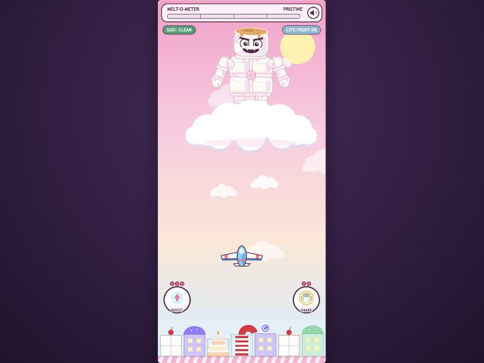 | 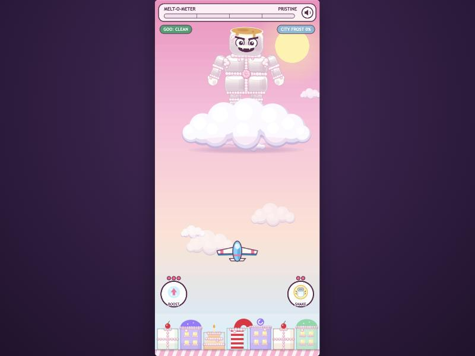 |
| 1. Arena as played | Lit boss, volumetric clouds, throne cloud with a drop shadow, sun glow, frosted city |
| 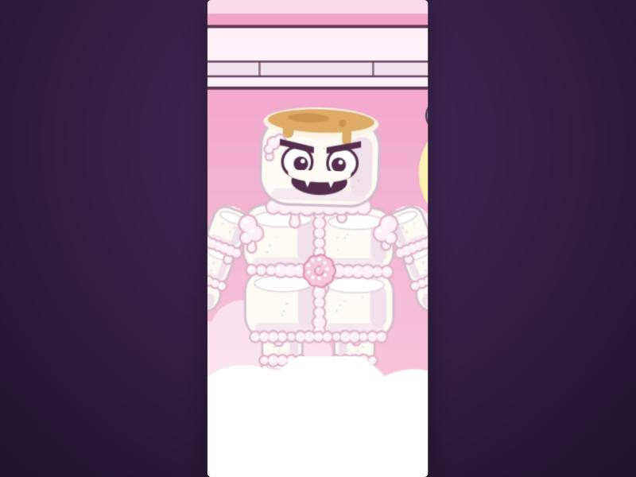 | 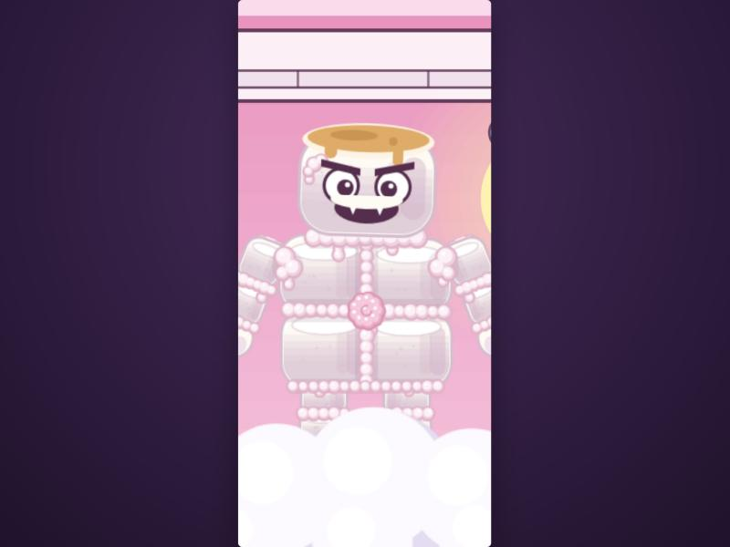 |
| 2. Boss close-up | Top-light gradient per lump, AO in the seams, glossy frosting; same toasted top and face |
| 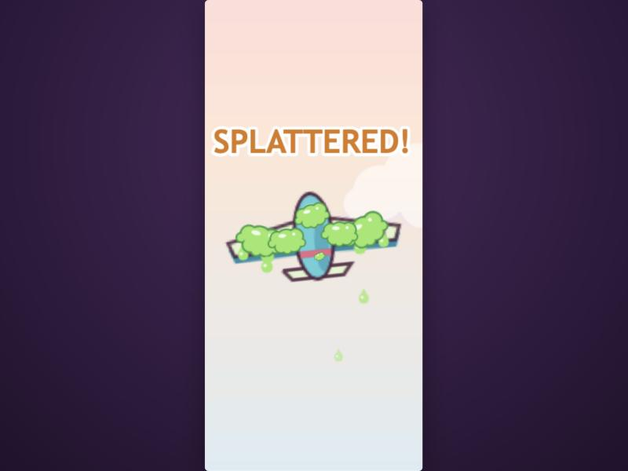 | 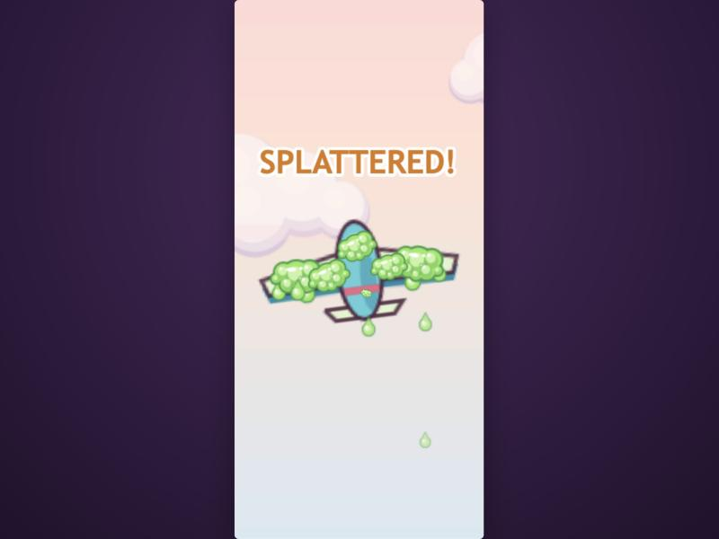 |
| 3. Goo on the glider (SPLATTERED) | Wet slime: dark edges, light cores, glints |
| 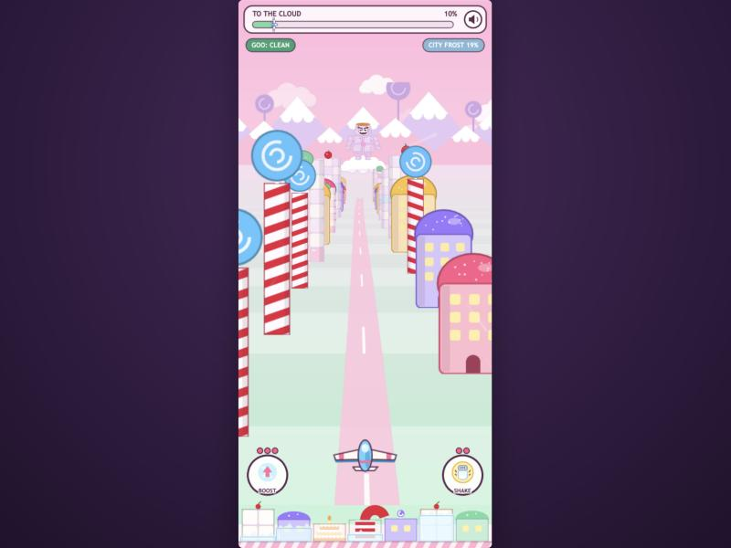 | 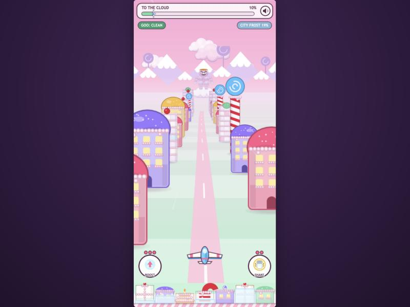 |
| 4. Flight valley at 10% | Frosted billboards, stronger, cooler horizon haze (the random billboard mix differs) |
| 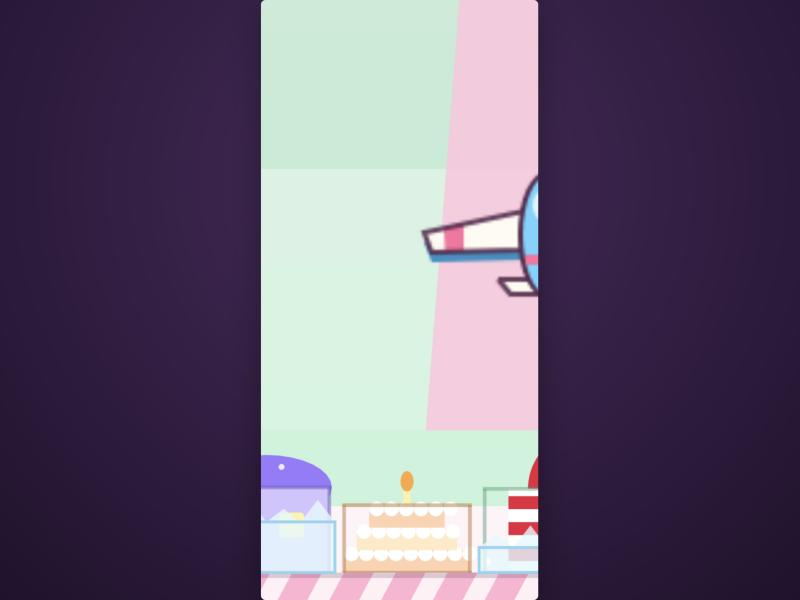 | 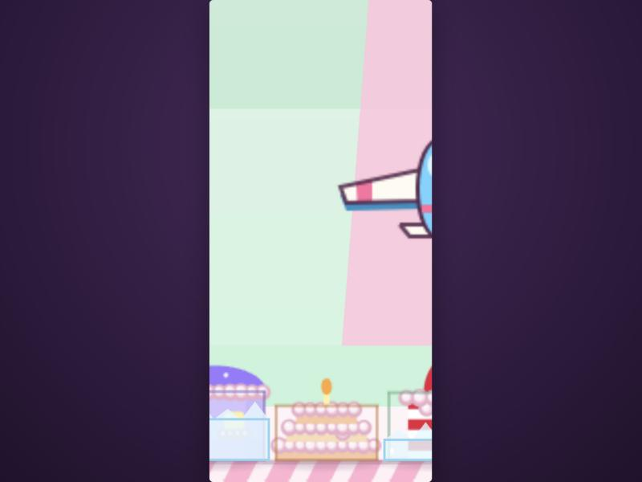 |
| 5. City strip, zoomed | Frosting sills, glossy bead tiers, shading, contact shadows |
| 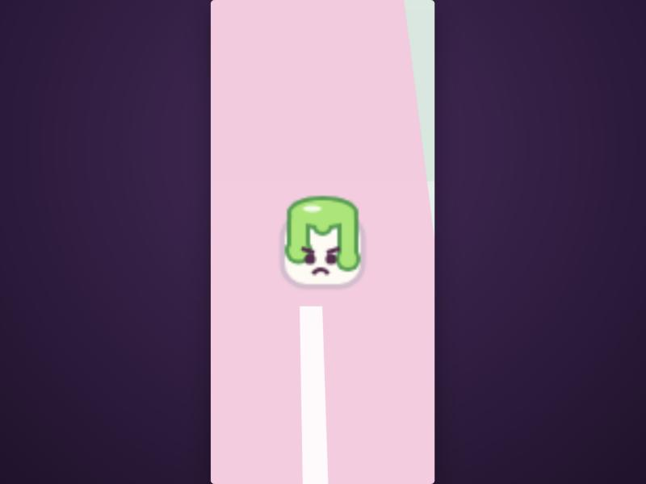 | 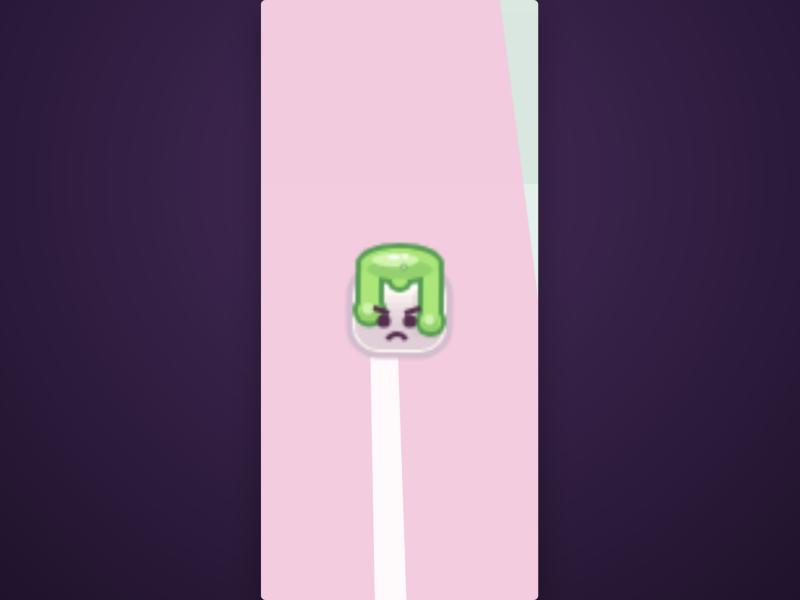 |
| 6. Goo-mallow projectile, zoomed | Glossy translucent ooze over a lit marshmallow |

## Deferred or skipped

- **The city strip looks soft under camera zoom**, because it is now a 1× texture rather than vector Graphics (5, zoomed). At actual play size it is pixel-equivalent. Only the harness zooms in; the game never does.
- **No real-time lighting or shaders.** All the "light" is painted into textures. That was the brief (no new per-frame cost), but it means the light direction is fixed: always upper-left, even when the boss tilts or the glider banks.
- **The goo coat on the glider reads lumpier than before** (3), because each blob now has its own highlight and shadow. It reads as slime; Finch may want it smoother.
- **Sky depth was kept subtle** (a slightly deeper top stop plus the sun glow) to follow "don't muddy it".

## Notes for the next prompt

- **Reusable helpers:** `litBody()`, `wetGoo()`, `cloudPuffs()`, `contactShadow()` and the glossy `frost()` live in `textures.js`. They are ready for residents, props or a glider repaint.
- **Bake static Graphics.** Any static Graphics layer can be baked with the same trick as `City` (`translateCanvas` + `generateTexture`), because Graphics objects replay their full command list every frame.
- **Still open from earlier responses:**
  - Shake window (0.9 s vs DESIGN's ~1.5 s).
  - HUD bars vs DESIGN's "no HUD bars".
  - Distant goo hitbox size in Flight.
  - ARM OFF! city-frost pressure.
