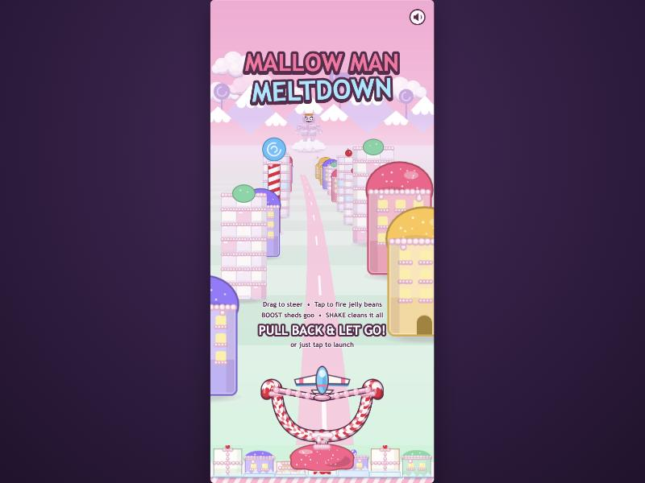
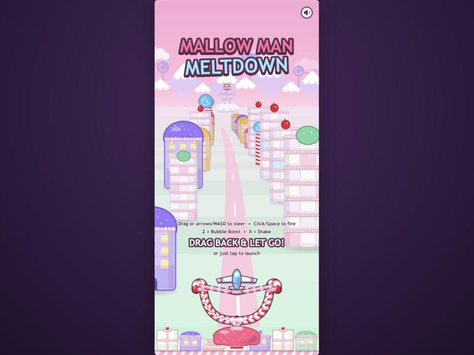
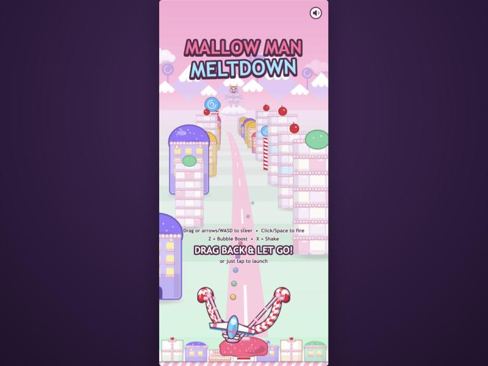
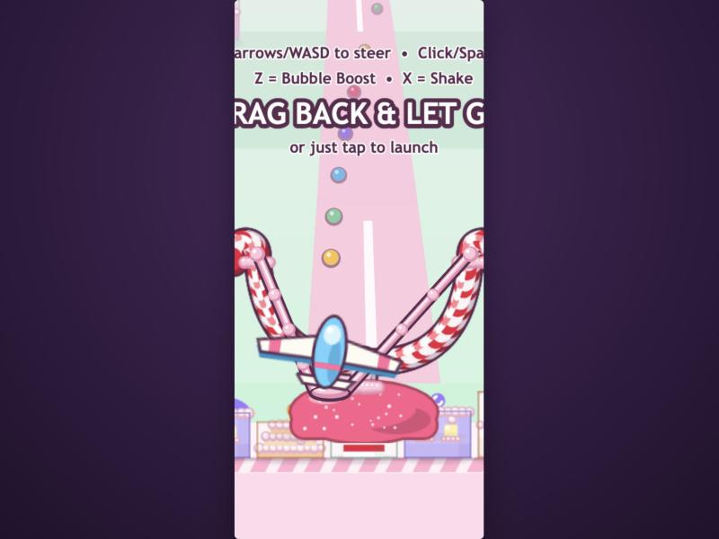
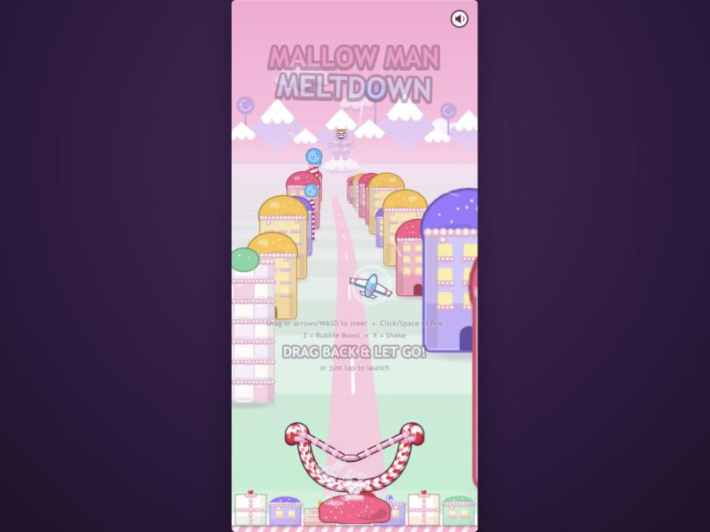
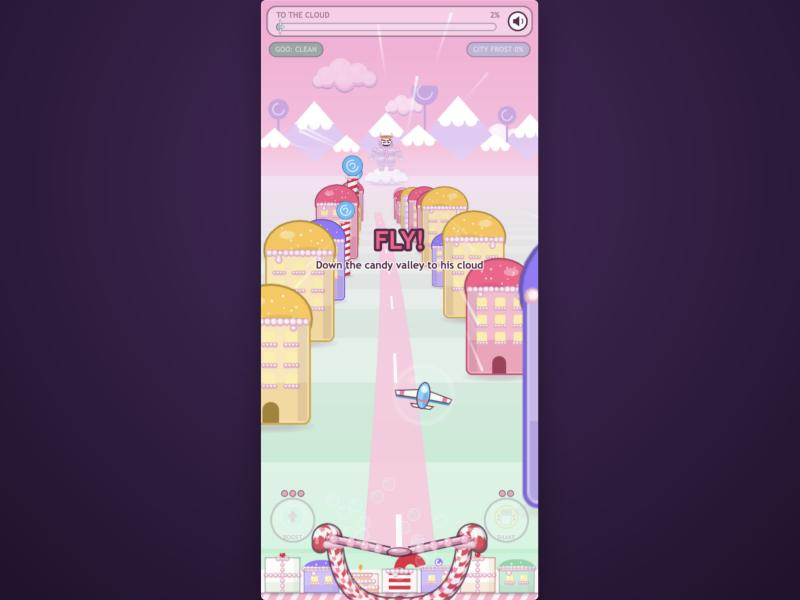
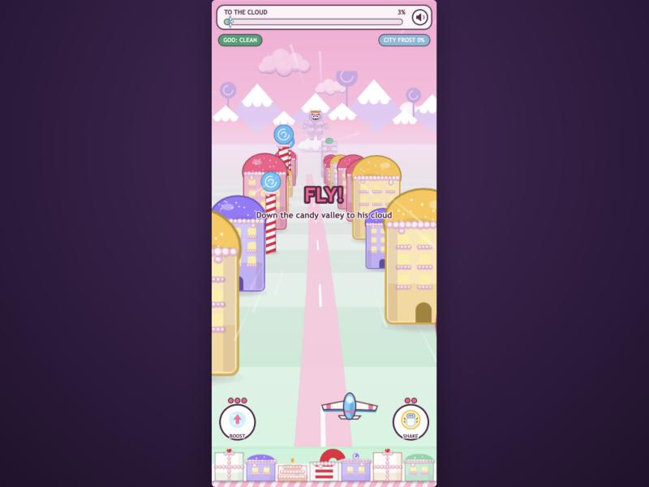
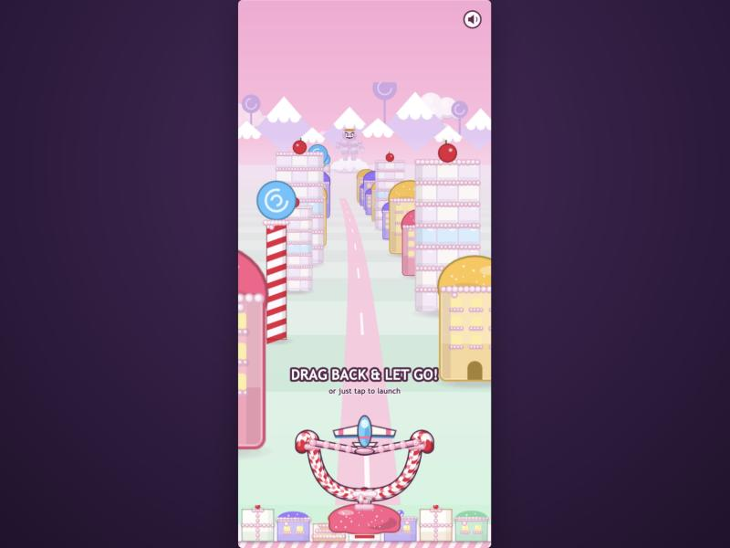
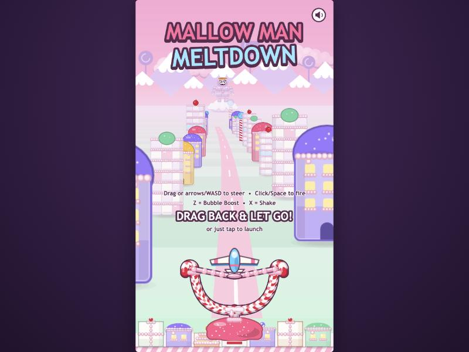

# prompt8 response — the slingshot launch

Implemented by Claude Code (Opus 5.5), 2026-10-02. The "CLICK TO FLY!" card is gone. The game now opens straight into the flight scene with the glider loaded in a candy slingshot and the title over it. You pull back, aim and let go, and the glider is flung into the valley with a speed burst. There is no scene change between the launch and the flight, because the launch is the first second of the flight scene. Once control is handed over, the flight, the boss fight and every mechanic run exactly as before (verified below).

## What changed

### New: `src/objects/Slingshot.js`

The whole launch lives in this one object. The flight scene creates it, updates it, and drops it once it's gone.

**The toy:**
- A baked `sling` texture with candy-cane forks that end in little crooks, sitting on a pink gumdrop base. It uses the same lit-tube treatment as prompt7 (shaded underside, highlight streak) and has pink frosting where the bands tie on, a frosting collar at the fork, and sugar sparkles.
- The two frosting bands and the pouch are drawn live, but only during the launch.
- Each band has a dark edge, a glossy pink body and a highlight. Bands thin as they stretch (volume-preserving), and three frosting beads ride each band and spread apart.
- The pouch is a frosting cradle under the glider's tail.

**The gesture:**
- The drag is relative (touch anywhere, like the flight steering): drag down to stretch, up to 150 px; drag sideways to aim, up to ±90 px.
- The pouch and glider follow 1:1. The glider grows up to 15% (pulled toward the camera) and tilts its nose toward where it will fly.
- Sprinkle dots arc from the nose to where the fling will peak. Pulling left flings right, slingshot-style, and the dots make that obvious.
- Rubbery creak ticks play as the bands stretch.

**Fast and forgiving:**
- **Tap:** a press that moves less than 14 px is a tap. It auto-draws to a default 70% pull in 0.14 s, then launches.
- **Weak or sideways-only drag:** a release with less than 20 px of pull launches at the default power; any other pull launches at no less than 45% power. Every release launches.
- **Keys:** Space, Enter, Up or W launch like a tap.
- **Idle demo:** every 2.6 s the pouch draws back a little and snaps, to show it's stretchy.

**The release:**
- A `boing` sound (sine drop with wobble plus a whoosh), a light camera shake, and the boost's bubble spray and shield flash, so the launch looks like a boost.
- The pouch snaps back on a spring and wobbles; the frame jiggles.
- The glider shoots up the valley and shrinks to 72% as it flies away from the camera (0.22 s), then glides down onto its cruise row and grows back (by 0.85 s). At that point control is handed over.

**Falling behind:** the slingshot drops off the bottom of the screen, growing and fading, over about 0.8 s, then destroys itself and removes its input listeners. The title and hint fade up and away on release. The HUD fades in, and the "FLY!" banner and start jingle play at +0.25 s.

### `src/scenes/FlightScene.js`

**Before release:**
- The world holds still: valley speed 0, no wind spawns, no progress, no spawning.
- The player's controls are off, and the sling positions the glider instead of the steering spring.

**At release, the burst:**
- `kick = 0.5 + power`, so the speed multiplier is ×(1 + kick): 1.95× to 2.5× at release, 2.2× for a tap.
- It decays with a 0.9 s time constant and is back to 1.05× by about 3 s.
- While it lasts it also speeds progress by ×(1 + 0.6·kick), giving a head start of about 0.65 s (≈1.6% of the 40 s flight).
- It's separate from the real boost: no charge is used, and there's no shield or speed-cap change.

**Spawn timers** start at launch, so the first obstacle (1.4 s) and first goo (2.2 s) come at the same moment after launch as they used to after the scene started.

**Opening details:**
- The title only shows on a fresh load or via TITLE; FLY AGAIN gets the slingshot with just the hint.
- The logo is placed above the horizon (`min(H·0.13, horizonY − 200)`) so the boss stays visible under it on short screens too.

### `src/scenes/BootScene.js`

It now just bakes textures, makes a new run and starts the flight with the title. The old title-card scene is removed, along with its now-unused `farsky` texture. The dev shortcuts (`?scene=boss|win|lose`) now go there immediately.

### Small hooks

- **`Glider.js`:**
  - `hold()` lets the sling place the glider (position, tilt, art scale, the body follows).
  - `release()` hands it back.
  - The boost's bubble-and-shield look is factored into `bubbleBurst()`, and `boost()` calls it with the same values, so boost is unchanged.
- **`Controls.js`:** an `enabled` flag; while the sling owns the pointer, no fire and no steering.
- **`Hud.js`:** `setShown(0…1)` fades the HUD chrome and BOOST/SHAKE. The button zones ignore presses while hidden, so a drag that starts where the buttons will appear pulls the slingshot instead.
- **`sfx.js`:** `stretch(k)` and `boing(power)`.
- **`textures.js`:** the `sling` texture, baked last so every other texture's random sprinkles are unchanged.
- **`EndScene.js`:** FLY AGAIN now passes `{ title: false }`. Phaser keeps a scene's previous start data when `start()` is called without data, so without this the title came back on a retry.
- **`README.md`:** launch controls, how-it-plays and layout updated.

## Verification

**Environment:** the in-app browser with the Vite dev server.
- Booted under mobile emulation (portrait 540×1169 canvas, touch device), and also at desktop aspect (540×960) for the short-screen layout.
- Frames were driven with `__game.loop.sleep()` + `__game.step()`. Where tweens matter (text fades, end-screen buttons), steps were paced 16 ms apart in real time.
- Input went through the real DOM paths: synthetic `TouchEvent`s on the canvas, `MouseEvent`s for the mouse, and `KeyboardEvent`s on `window`. So everything went through Phaser's input managers, not by calling methods.
- `npm run build` is clean.

| Criterion | What I observed |
| --- | --- |
| Dragging back stretches the bands and shows aim | Touch at (300,700), dragged to (240,830): pull 130 px, pouch sideways −42 px. The glider moved to (228,1047), its art scale went 1.333 → 1.507, and it tilted its nose 0.187 rad toward the right. Bands thin, beads spread, sprinkle dots arc up-right (screenshots 2, 3). No bean fired (`stats.beans` 0) and progress stayed at 0 throughout. |
| Releasing flings into the valley with a speed burst | Same drag released (power 0.87, kick 1.37). Valley speed was 2.34× cruise on the first frame, 1.53× at hand-over (0.85 s), 1.05× at 3 s and 1.02× at 4 s. The glider rose to its apex at (314,620) at 72% scale, glided to (343,971) on its cruise row (aimed right, as pulled left), and control returned at frame 51. The pouch wobbled through +105 → −52 → +33 → −16 → +3 px. The sling dropped 270 px and faded out by the hand-over. |
| Tap-only launches cleanly at the default | A press-and-release with no movement auto-drew to 105 px (70%) in 8 frames, launched with kick 1.2, flew straight to (270,971) and handed over about 1.0 s after the tap. No bean fired and no boost was used. |
| Keyboard and mouse | Space and Enter each launch at the default. A mouse drag right and down flung the glider left to x=171 (the full left aim). |
| No gesture conflict with BOOST/SHAKE | While in the sling, the BOOST zone's `input.enabled` is false. A touch that starts exactly on BOOST's spot (62,1013) and drags pulled the slingshot (boosts stayed 3). After hand-over the zone is enabled, and a tap on it boosted (3 → 2). A tap elsewhere fired a bean (0 → 1). Layout: the frame spans about x 121–419 and the pulled glider's art stays within about x 121–419, clear of the button circles (x ≤ 112 and ≥ 428). |
| Seamless transition | No scene change: the slingshot is part of the flight scene, and the valley simply starts moving. After the launch the scene has 189 display objects and 13 Graphics, exactly prompt7's measured flight-scene counts, and only the Controls' pointer listeners remain (1 down, 1 move, 1 up). Nothing lingers per frame. |
| Flight behaves as before | A full run after a tap launch, with the harness keeping the glider clean and the city unfrozen: hand-over at 1.0 s; first obstacle 1.4 s and first goo 2.2 s after launch (the old timers); arrival 39.35 s after launch (40 s nominal minus the burst's head start); then the boss scene. Spawns: 20 obstacles, 23 goo, 5 pickups, 2 arches. |
| Boss behaves as before | `BossScene.js` is untouched. In the arena after that flight: SAGGING threw 3 bombs in 5.5 s, consistent with prompt5's ~2.4 s rhythm, the HUD was fully shown and the controls were enabled. |
| Retry and title paths | END → FLY AGAIN: slingshot with the hint, no title. END → TITLE: slingshot with the title. |
| Zero console errors | None across boot, many launches (touch, tap, mouse, keyboard), a full flight, the boss and both end paths. |

## Screenshots

| | |
| --- | --- |
|  |  |
| 1. Opening on a phone: title, valley, glider loaded in the slingshot | 1b. Same on desktop (mouse and keyboard wording) |
|  |  |
| 2. Pulled back and aimed left: dots show the fling going right | 3. Close-up: thinned bands, spread beads, pouch, tilted glider |
|  |  |
| 4. Release +0.22 s: glider at the apex (smaller, bubble shield), bands snapping, title fading | 5. +0.5 s: valley rushing (wind streaks), slingshot falling behind, HUD fading in, FLY! |
|  |  |
| 6. +0.9 s: normal flight, player in control | 7. FLY AGAIN: straight back into the slingshot, no title |
|  | |
| 8. 540×960 canvas: the logo sits above the boss on the horizon | |

## Deferred or skipped

- **The sling falls behind in screen space, not true 3D.** Anchored on the projected ground, it would whip off-screen in about 0.1 s at burst speed. Instead it drops and grows over 0.8 s, which reads as left behind.
- **The help text shows only with the title** (fresh load or TITLE), not on FLY AGAIN.
- **The title card is removed outright**, not kept as a separate step. The first touch on the slingshot unlocks audio (it's a user gesture), so the boing plays on the very first release. With the dev shortcuts (`?scene=boss`…) there's no start jingle any more; sound unlocks on the first touch in that scene.
- **No haptics.** `navigator.vibrate` on release would be a cheap win on Android, but iOS Safari ignores it.
- **A second finger during the fling isn't picked up as steering.** Controls are off until the hand-over (0.85 s), so a finger that lands in that window doesn't steer until it's lifted and put down again.

## Notes for the next prompt

- **DESIGN.md open question resolved.** "Slingshot launch vs. auto-start" is settled in favour of the launch, so Finch may want to update DESIGN.md.
- **Latent bug, not touched (boss behaviour is out of scope).** Phaser's `scene.start(key)` without data keeps the scene's previous start data. That bit FLY AGAIN here (fixed by passing explicit data).
  - The same mechanism should affect the boss: after a RETRY BOSS (`{ retry: true }`), the next normal arrival from the flight (`scene.start('Boss')`, no data) still sees `retry: true`, so it doesn't refresh `bossCheckpoint`. A later RETRY BOSS would then restore an older run's state.
  - I inferred this from Phaser's `Systems.start` code; I didn't reproduce it.
  - Fix: one line, `this.scene.start('Boss', {})` in `FlightScene.arrive()`.
- **Tuning knobs** sit at the top of `Slingshot.js`: max pull and aim, default and minimum power, fling timings. The burst size (`kick = 0.5 + power`) and its decay (`KICK_DECAY`) are in FlightScene.
- **Harness notes:**
  - Synthetic `Touch` objects need `pageX/pageY`, because Phaser reads those, not `clientX/Y`.
  - Phaser lag-smooths tween time to at most 33 ms per step. Instant manual stepping therefore freezes tween-driven bits (text fades, end-screen buttons), so pace steps in real time when they matter.
- **Still open from earlier responses:**
  - Shake window (0.9 s vs DESIGN's ~1.5 s).
  - HUD bars vs DESIGN's "no HUD bars".
  - Distant goo hitbox size in Flight.
  - ARM OFF! city-frost pressure.
