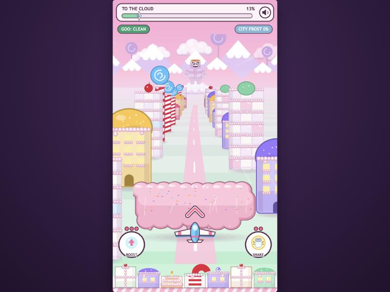
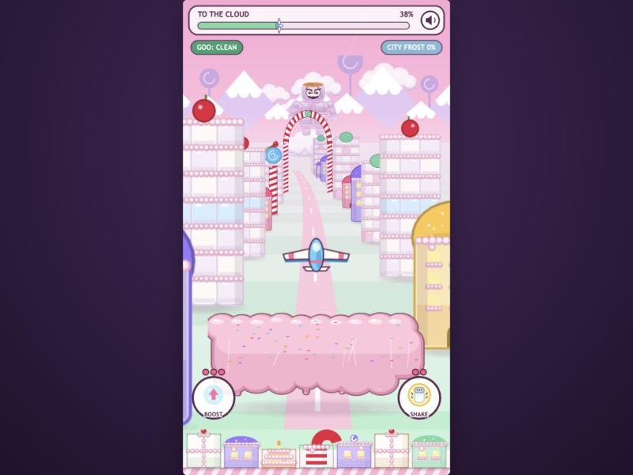
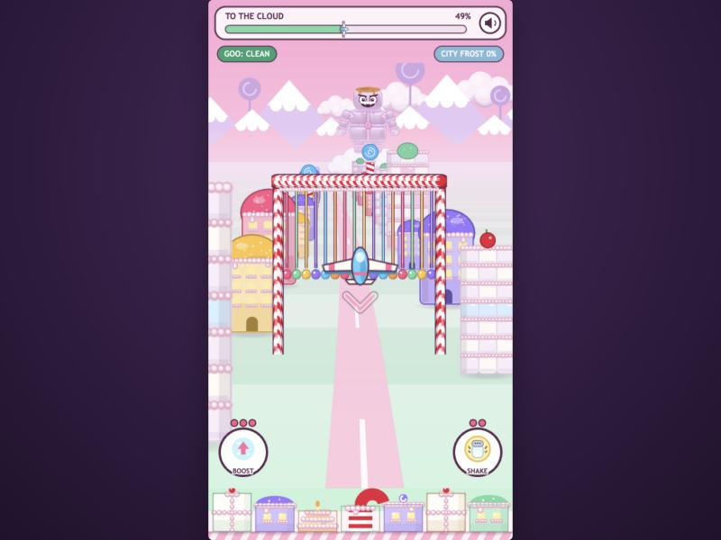
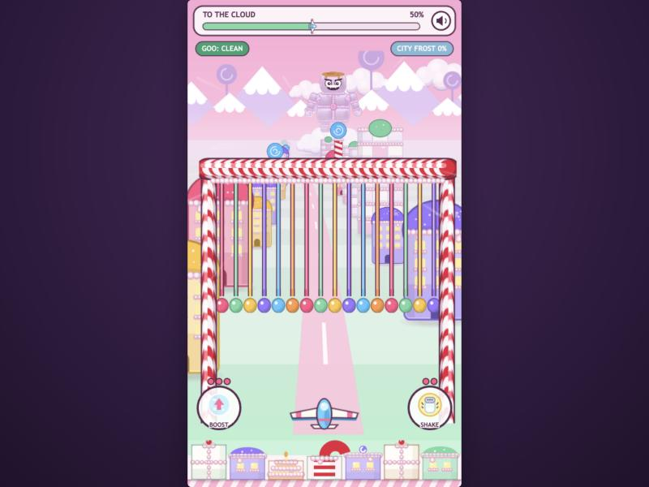
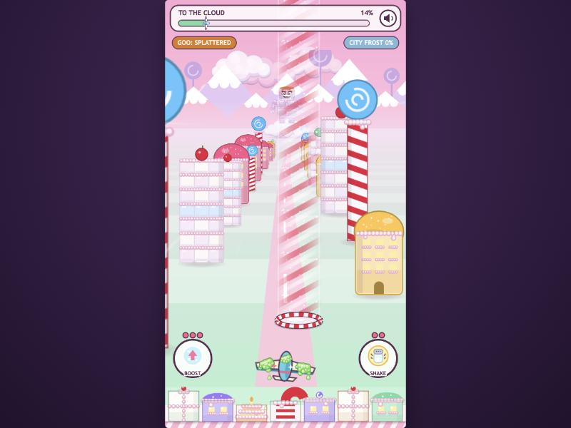
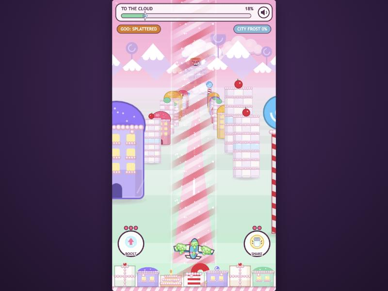

# prompt9 response — altitude matters

Implemented by Claude Code (Opus 5.5), 2026-10-02.

**What was wrong.** Before this, flight obstacles were projected onto a single flight plane and swept down the screen through every height, so up and down never helped you dodge anything.

**What's new.** The flight now has two valley-spanning obstacle kinds that care how high you are, plus candy-cane thermals. Controls, speeds and the existing goo and damage numbers are unchanged. The obstacle spawn timer is untouched; only the mix changed.

## What changed

### New: `src/view/Heights.js`

The module draws these obstacles in the projected valley. Everything in it is pooled: 3 gates, 3 banks, 2 thermals, one cue sprite and one small particle emitter.

**Candy-cane gate (dive under):**
- Candy-cane legs stand on the valley walls, and a striped crossbar sits above the glider's ceiling, so there is never a way over.
- A curtain of candy strands with a row of glossy candy tips hangs from the bar down to a *hang line*.
- Hang depth varies per gate (30–60% of the glider's height range). Short curtains only matter if you're flying high; long ones force a deep dive.
- Hitting it is the existing obstacle bonk (`glider.bonk`): knocked down and aside.

**Sticky frosting bank (climb over):**
- A puffy, glossy pink frosting cloud floating just above the ground across the whole lane, with sticky strings and sprinkles.
- Its top line sits 50–68% of the way down the height range, and its bottom is below the glider's floor, so there is no going under.
- Touching it is exactly a goo-mallow hit:
  - The goo amount comes from the same `gooAmount()` the goo-mallows now use (factored out in `Projectiles.js`; still 0.95–1.25).
  - It goes through the same `applyGoo`, so the bubble shield blocks it and the same splat, list and tier rules apply.

**How hits are decided:**
- Each gate or bank is tested **once, at the moment it passes the glider's depth**, against where its line is on screen right then (tilt included).
- So what you see is what you hit:
  - A gate's tips sweep down to the glider's row exactly as it arrives.
  - A bank you're clear of passes visibly underneath you.
- After passing, they fade out quickly rather than sweeping across the screen.

**Readability:**
- Each kind has its own altitude look: striped canes plus a candy curtain hanging from above, versus puffy pink frosting floating below.
- Both appear on the horizon about 4 s before they arrive (the existing spawn depth and approach time).
- A **cue chevron** (a bold candy V) pulses beside the glider while one is ≤1.4 s out *and you're in its blocked band*: below you for "dive", above you for "climb". It disappears the moment you're in the clear.
- Nothing about the existing valley, boss-on-horizon or decorative arches changed.

**Candy-cane thermals (DESIGN.md's lift):**
- A translucent column of rising red-and-white candy stripes, with shimmering edges and sparkles, rising out of a candy-cane vent on the valley floor.
- **Inside** means the column is near your depth *and* you overlap it on screen (beside it and above its vent). Again, what you see is what you get.
- While inside:
  - The steering target rises at `TUNE.thermalLift` (420 px/s), with a small upward pop on entry.
  - Goo drips off `TUNE.thermalDrip` (6×) faster, including the coat's visible drops.
  - Pink and white sparkles rise around the glider, and a soft "whoosh" plays on entry (`Sfx.thermal`).
- Thermals are a reward on their own timer (first at 6 s, then every 10–14 s, about 3 per flight), not part of obstacle pressure.

### `src/scenes/FlightScene.js`

**Obstacle mix.** The same slot and timer now pick among five kinds at 20% each: ledge, licorice gate, gumdrops, frosting bank and candy-cane gate (was ledge 35% / licorice 35% / gumdrops 30%).

**Teaching pair.** The 2nd obstacle is always a bank and the 3rd a low gate right behind it, so every run asks for a climb and then a dive early on.

**Fallback.** If a height pool is exhausted, the slot falls back to a ledge, so pressure is never skipped.

### Other files

- **`Glider.js`:** a `thermal` flag set each frame by the flight. When it's set, lift is added to the steering target and the drip rate is multiplied. Nothing else changes; the boss scene never sets it.
- **`config.js`:** two new thermal knobs, `thermalLift` and `thermalDrip`. No existing value changed.
- **`textures.js`:** gate parts, bank, bank shadow, thermal tile, vent and cue, baked last so every existing texture's random details are unchanged.

## Verification

**Environment:** the in-app browser with the Vite dev server, booted at both canvas sizes the game uses (540×1169 under phone emulation and 540×960 at desktop aspect). Frames were driven with `__game.loop.sleep()` + `__game.step()`, and screenshots were taken with real-time pacing so tweens are current. `npm run build` is clean.

**Bots.** Full flights, launch to cloud, ~38 s each. Every bot fires every 0.25 s. As in earlier prompts, the harness clears goo above 3 and keeps city frost at 0 so runs reach the cloud. Three bots:
- **low:** holds the home row.
- **high:** holds the ceiling.
- **cue:** a player who only watches the chevron. When it appears it commits for 1.5 s in that direction, otherwise drifting back home.

| Run | Gates (hits) | Banks (hits) | Climbs / dives | Thermals ridden |
| --- | --- | --- | --- | --- |
| low | 7 (0) | 6 (5; the 6th hadn't arrived before the cloud) | — | 2 of 3 |
| high | 5 (**5**) | 5 (0) | — | 3 of 3 |
| cue #1 | 3 (0) | 6 (0) | 6 / 1 | 1 of 3 |
| cue #2 | 2 (0) | 4 (0) | 4 / 1 | 3 of 3 |
| cue #3 | 5 (0) | 6 (0) | 5 / 2 | 3 of 3 |
| cue #4 | 7 (0) | 5 (1) | 5 / 2 | 2 of 3 |
| cue #5 | 7 (0) | 3 (0) | 3 / 3 | 2 of 3 |

| Criterion | What I observed |
| --- | --- |
| A flight forces both climbing and diving | Staying low gets you gooed by banks and staying high gets you bonked by gates (rows *low* / *high*). The cue-follower had to climb **and** dive in every one of its 5 runs, and it cleared 29 of 30 gates and banks on the chevron alone. The one bank it clipped arrived while it was still committed to its previous move. |
| Thermals visibly lift | Clean glider at its home row: inside for 0.70 s, rose 220 px. Flying high: enters earlier, inside for 1.02 s, rose 139 px until it reached the ceiling. Gooed (2.6) at the floor: inside for 0.58 s, rose 119 px. Screenshots 5–6 show the column ahead and the glider riding inside it with sparkles. |
| Thermals accelerate drip-off | Same glider with 2.6 goo: 0.064 goo/s lost outside a thermal vs about 0.45 goo/s inside (≈7×; the knob is 6×, and heavier coats drip slower per unit). The coat's falling drops increase in step. |
| Bank goo = goo-mallow goo | One bank hit added 0.95 goo (tier DUSTED, screenshot during testing). The code path is the same `applyGoo(x, gooAmount())` the goo-mallows use. |
| Gate hit | A glider held near the ceiling (y 589 on the 1169 canvas) met a 0.5 gate and was bonked on the crossing frame (vy +266 downward, stun 0.26 s). A glider at the home row under a deep (0.6) gate: no hit. |
| Spawn pressure unchanged | 20–21 obstacles per flight in these runs vs 20 in prompt8's run, from the same untouched timer. Goo-mallow and pickup spawning is untouched. |
| Mechanics numbers unchanged | `git diff src/config.js`: only the two new thermal knobs were added. Goo amount, bonk, boost, shake, speeds, steering and spawn timers are untouched. |
| Zero console errors | None across all runs at both canvas sizes. |

## Screenshots

| | |
| --- | --- |
|  |  |
| 1. A frosting bank coming at the home row: the ▲ cue says climb | 2. Climbed: the bank passes underneath (a decorative arch in the distance) |
|  |  |
| 3. Flying high into a candy-cane gate: the ▼ cue says dive | 4. Dived: the candy curtain passes overhead |
|  |  |
| 5. A thermal rising from its candy-cane vent ahead | 6. Riding it: column around the glider, goo dripping faster, sparkles |

## Deferred or skipped

- **Gates are never climbable.** The prompt says some gates hang so low that going under is the only play. Here every gate's bar is above the ceiling, and depth varies only how far you must dive. A gate with open sky above it would make "over or under" a choice; that's an easy variant if Finch wants it.
- **No HUD indicator for thermals.** They're found by sight (stripes and the vent) and rewarded with sparkles and sound.
- **The decorative valley arches are unchanged** (the prompt says visuals stay). They still sweep overhead harmlessly, so there are two arch looks: the decorative arch (no curtain) is harmless, and the curtain gate is the obstacle.
- **The cue chevron is new UI**, but it's an in-world glyph next to the glider rather than HUD text. It was added for "the player should never wonder whether to climb or dive".

## Notes for the next prompt

- **Next prompt's arrival.** `FlightScene.arrive()` now also has to contend with height obstacles still in flight. They don't hit while the glider is on autopilot, so the arrival is safe.
- **Tuning knobs:**
  - Thermal: `TUNE.thermalLift` and `TUNE.thermalDrip`; ride window and width at the top of `Heights.js`.
  - Gate hang range (0.3–0.6) and bank top range (0.5–0.68): `FlightScene.spawnObstacle`.
  - Cue lead time: `WARN` (1.4 s) in `Heights.js`.
- **Harness note.** "Inside a thermal" depends on screen overlap, which shifts slightly with camera sway. Bots that sit still at the centre ride about 2 of 3 thermals per flight.
